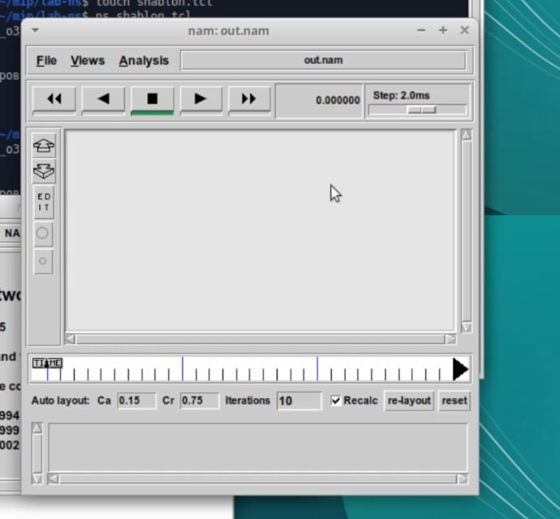

---
## Front matter
lang: ru-RU
title: Лабораторная работа №1
subtitle: Простые модели компьютерной сети
author:
  - Алиева Милена Арифовна
institute:
  - Российский университет дружбы народов, Москва, Россия

## i18n babel
babel-lang: russian
babel-otherlangs: english

## Formatting pdf
toc: false
toc-title: Содержание
slide_level: 2
aspectratio: 169
section-titles: true
theme: metropolis
header-includes:
 - \metroset{progressbar=frametitle,sectionpage=progressbar,numbering=fraction}
 - '\makeatletter'
 - '\beamer@ignorenonframefalse'
 - '\makeatother'
---

# Содержание 

1. Цель
2. Задания
3. Порядок выполнения
4. Вывод

# Цель

Целью данной работы является получение практических навыков работы в консоли с расширенными атрибутами файлов

# Задание

Познакомиться на примерах с тем, как используются основные и расширенные атрибуты при разграничении доступа

# Порядок выполнения

1.  В своём рабочем каталоге создаём директорию mip, в которой будут выполняться лабораторные работы. Внутри mip создаём директорию lab-ns, а в ней файл
shablon.tcl. 

{#fig:001 width=70%}

# Порядок выполнения

2. Открываем на редактирование файл shablon.tcl. Сначала создадим объект типа Simulator, создадим переменную nf и укажем, что требуется открыть на запись nam-файл для регистрации выходных результатов моделирования, вторая строка даёт команду записывать все данные о динамике модели в файл out.nam. Далее создадим переменную f и откроем на запись файл трассировки для регистрации всех событий модели. После этого добавим процедуру finish, которая закрывает файлы трассировки и запускает nam. С помощью команды at указываем планировщику событий, что процедуру finish запустим через 5 с после начала моделирования, после чего запустим симулятор ns. 

{#fig:002 width=70%}

# Порядок выполнения

3. Сохранив изменения в отредактированном файле shablon.tcl и закрыв его, запустим симулятор командой ns shablon.tcl. Увидим пустую область моделирования, поскольку ещё не определены никакие объекты и действия.

{#fig:003 width=70%}

# Порядок выполнения

4. Выполним второй пример, который посвящён описанию топологии сети, состоящей из двух узлов и одного соединения. Нам требуется смоделировать сеть передачи данных, состоящую из двух узлов, соединённых дуплексной линией связи с полосой пропускания 2 Мб/с и задержкой 10 мс, очередью с обслуживанием типа DropTail. От одного узла к другому по протоколу UDP осуществляется передача пакетов, размером 500 байт, с постоянной скоростью 200 пакетов в секунду. 

{#fig:004 width=70%}

# Порядок выполнения

5. Сохранив изменения в отредактированном файле и запустив симулятор, получим анимированный результат моделирования.

{#fig:005 width=70%}

# Порядок выполнения

6. Выполним третий пример.
Описание моделируемой сети:
- сеть состоит из 4 узлов (n0, n1, n2, n3);
- между узлами n0 и n2, n1 и n2 установлено дуплексное соединение с пропускной способностью 2 Мбит/с и задержкой 10 мс;
- между узлами n2 и n3 установлено дуплексное соединение с пропускной способностью 1,7 Мбит/с и задержкой 20 мс;
- каждый узел использует очередь с дисциплиной DropTail для накопления пакетов, максимальный размер которой составляет 10;
- TCP-источник на узле n0 подключается к TCP-приёмнику на узле n3 (по-умолчанию, максимальный размер пакета, который TCP-агент может генерировать, равняется 1KByte)

# Порядок выполнения

TCP-приёмник генерирует и отправляет ACK пакеты отправителю и откидывает полученные пакеты;
- UDP-агент, который подсоединён к узлу n1, подключён к null-агенту на узле n3 (null-агент просто откидывает пакеты);
- генераторы трафика ftp и cbr прикреплены к TCP и UDP агентам соответственно;
- генератор cbr генерирует пакеты размером 1 Кбайт со скоростью 1 Мбит/с;
- работа cbr начинается в 0,1 секунду и прекращается в 4,5 секунды, а ftp начинает работать в 1,0 секунду и прекращает в 4,0 секунды.

# Порядок выполнения

Откроем example2.tcl на редактирование, создадим 4 узла и 3 дуплексных соединения с указанием направления, создадим агент UDP с прикреплённым к нему источником CBR и агент TCP с прикреплённым к нему приложением FTP, создадим агенты-получатели, соединим агенты udp0 и tcp1 и их получателей, зададим описание цвета каждого потока, выполним отслеживание событий в очереди и наложение ограничения на размер очереди, добавим at-события.

{#fig:006 width=70%}

# Порядок выполнения

7. Сохранив изменения в отредактированном файле и запустив симулятор, получим анимированный результат моделирования.

{#fig:007 width=70%}

# Порядок выполнения

8. Описание модели передачи данных по сети с кольцевой топологией и динамической маршрутизацией пакетов:

- сеть состоит из 7 узлов, соединённых в кольцо;
- данные передаются от узла n(0) к узлу n(3) по кратчайшему пути;
- с 1 по 2 секунду модельного времени происходит разрыв соединения между узлами n(1) и n(2);
- при разрыве соединения маршрут передачи данных должен измениться на резервный.

# Порядок выполнения

Откроем example3.tcl на редактирование. Опишем топологию моделируемой сети, соединим узлы так, чтобы создать круговую топологию. Каждый узел, за исключением последнего, соединяется со следующим, последний соединяется с первым, для этого в цикле использован оператор %, означающий остаток от деления нацело. Зададим передачу данных от узла n(0) к узлу n(3). Данные передаются по кратчайшему маршруту от узла n(0) к узлу n(3), через узлы n(1) и n(2).

{#fig:008 width=70%}

# Порядок выполнения

9. Сохранив изменения в отредактированном файле и запустив симулятор, получим анимированный результат моделирования 

{#fig:009 width=70%}

{#fig:010 width=70%}
ра]
# Порядок выполнения

10. Добавив в начало скрипта $ns rtproto DV и увидим, что сразу после запуска в сети отправляется небольшое количество маленьких пакетов, используемых для обмена информацией, необходимой для маршрутизации между узлами, а когда соединение будет разорвано, информация о топологии будет обновлена, пакеты будут отсылаться по новому маршруту через узлы n(6), n(5) и n(4).

{#fig:011 width=70%}

{#fig:012 width=70%}

# Порядок выполнения

11. Выполним упражнение, для этого внесем следующие изменения в реализацию примера с кольцевой топологией сети:

- передача данных должна осуществляться от узла n(0) до узла n(5) по кратчайшему пути в течение 5 секунд модельного времени;
- передача данных должна идти по протоколу TCP (тип Newreno), на принимающей стороне используется TCPSink-объект типа DelAck; поверх TCP работает протокол FTP с 0,5 до 4,5 секунд модельного времени;
- с 1 по 2 секунду модельного времени происходит разрыв соединения между узлами n(0) и n(1);
- при разрыве соединения маршрут передачи данных должен измениться на резервный, после восстановления соединения пакеты снова должны пойти по кратчайшему пути.

# Порядок выполнения

{#fig:013 width=70%}

# Выводы

В процессе выполнения данной лабораторной работы я приобрела навыки моделирования сетей передачи данных с помощью средства имитационного моделирования NS-2, а также проанализировала полученные результаты моделирования.
