---
## Front matter
lang: ru-RU
title: Лабораторная работа №2
subtitle: Исследование протокола TCP и алгоритма управления очередью RED
author:
  - Алиева Милена Арифовна
institute:
  - Российский университет дружбы народов, Москва, Россия

## i18n babel
babel-lang: russian
babel-otherlangs: english

## Formatting pdf
toc: false
toc-title: Содержание
slide_level: 2
aspectratio: 169
section-titles: true
theme: metropolis
header-includes:
 - \metroset{progressbar=frametitle,sectionpage=progressbar,numbering=fraction}
 - '\makeatletter'
 - '\beamer@ignorenonframefalse'
 - '\makeatother'
---

# Содержание 

1. Цель
2. Задания
3. Порядок выполнения
4. Вывод

# Цель

Исследовать протокол TCP и алгоритм управления очередью RED.

# Задание

1. Выполнить пример с дисциплиной RED;
2. Изменить в модели на узле s1 тип протокола TCP с Reno на NewReno, затем на Vegas. Сравнить и пояснить результаты;
3. Внести изменения при отображении окон с графиками (изменить цвет фона, цвет траекторий, подписи к осям, подпись траектории в легенде).

# Порядок выполнения

1.  Выполним построение сети в соответствии с описанием:
- сеть состоит из 6 узлов;
- между всеми узлами установлено дуплексное соединение с различными пропускной способностью и задержкой 10 мс;
- узел r1 использует очередь с дисциплиной RED для накопления пакетов, максимальный размер которой составляет 25;
- TCP-источники на узлах s1 и s2 подключаются к TCP-приёмнику на узле s3;
генераторы трафика FTP прикреплены к TCP-агентам.
Теперь разработаем сценарий, реализующий модель согласно описанию, чтобы построить в Xgraph график изменения TCP-окна, график изменения длины очереди и средней длины очереди.

# Порядок выполнения

2. После запуска кода получаем график изменения TCP-окна (рис. [-@fig:002]), а также график изменения длины очереди и средней длины очереди (рис. [-@fig:003]).

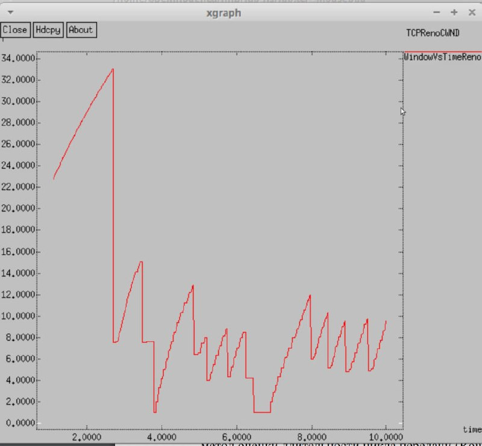{#fig:002 width=70%}

# Порядок выполнения

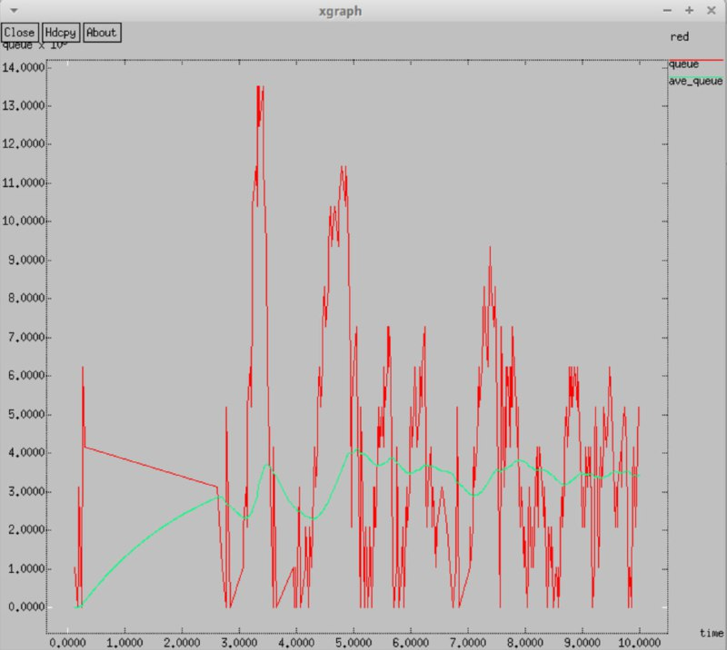{#fig:003 width=70%}

# Порядок выполнения

3. Теперь изменим тип Reno на NewReno (рис. [-@fig:004]).

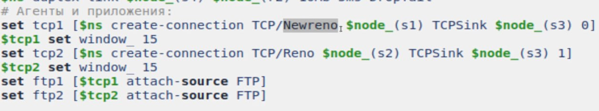{#fig:004 width=70%}

# Порядок выполнения

4. После запуска кода получаем график изменения TCP-окна (рис. [-@fig:005]), а также график изменения длины очереди и средней длины очереди (рис. [-@fig:006]). Видим, что значение средней длины очереди находится в пределах от 2 до 4, а максимальное значение длины равно 14, как и на предыдущем графике. В обоих алгоритмах размер окна увеличивается до тех пор, пока не произойдёт потеря сегмента.

# Порядок выполнения

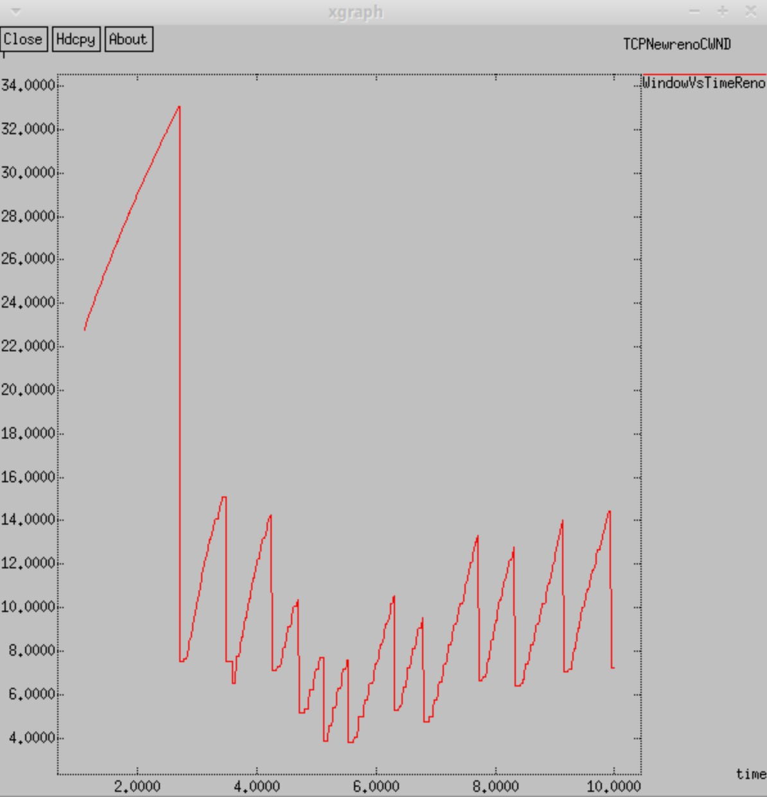{#fig:005 width=70%}

# Порядок выполнения

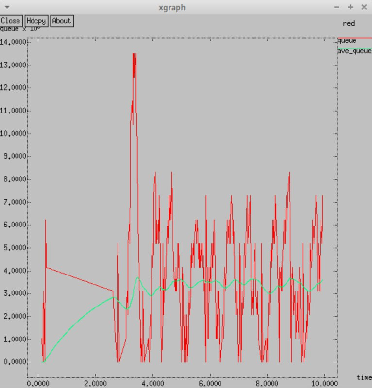{#fig:006 width=70%}

# Порядок выполнения

5. Изменим тип Reno на Vegas (рис. [-@fig:007]).

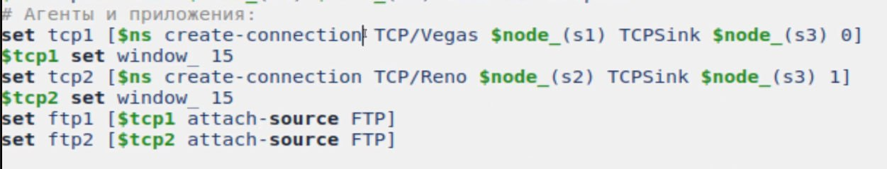{#fig:007 width=70%}

# Порядок выполнения

6. После запуска кода получаем график изменения TCP-окна (рис. [-@fig:008]), а также график изменения длины очереди и средней длины очереди (рис. [-@fig:009]). Видим, что средняя длина очереди опять находится также в диапазоне от 2 до 4, а максимальная длина достигает значения 14. Довольно сильные отличия можно заметить по графикам динамики размера окна, так как при Vegas максимальный размер окна составляет 20, а не 34, как в предыдущих графиках. Это происходит по той причине, что TCP Vegas обнаруживает перегрузку в сети до того, как случайно теряется пакет, и мгновенно уменьшается размер окна, получается, что TCP Vegas обрабатывает перегрузку без каких-либо потерь пакета.

# Порядок выполнения

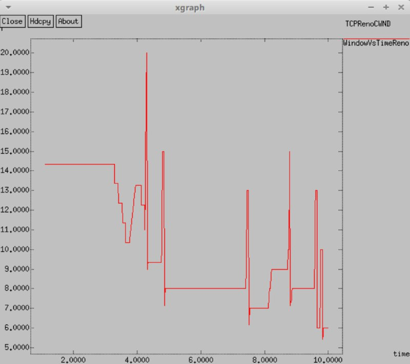{#fig:008 width=70%}

# Порядок выполнения

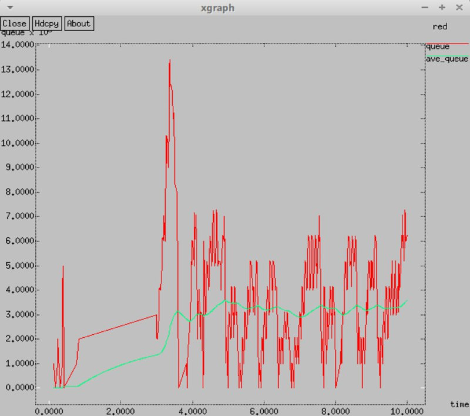{#fig:009 width=70%}

# Порядок выполнения

7. Внесем изменения при отображении окон с графиками, изменим цвет фона, цвет траекторий, подписи к осям и подпись траектории в легенде.

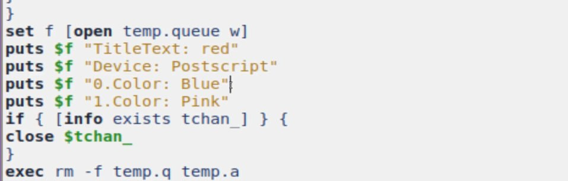{#fig:010 width=70%}

# Порядок выполнения

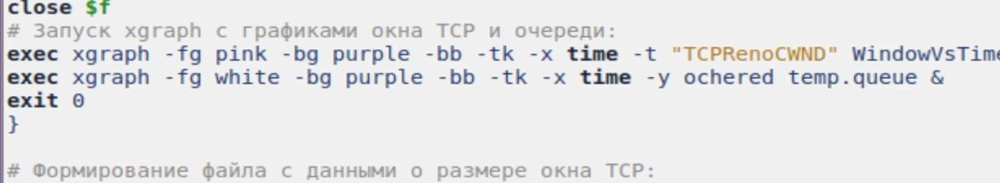{#fig:011 width=70%}

# Порядок выполнения

8. После запуска кода получаем график изменения TCP-окна (рис. [-@fig:012]), а также график изменения длины очереди и средней длины очереди (рис. [-@fig:013]). 

# Порядок выполнения

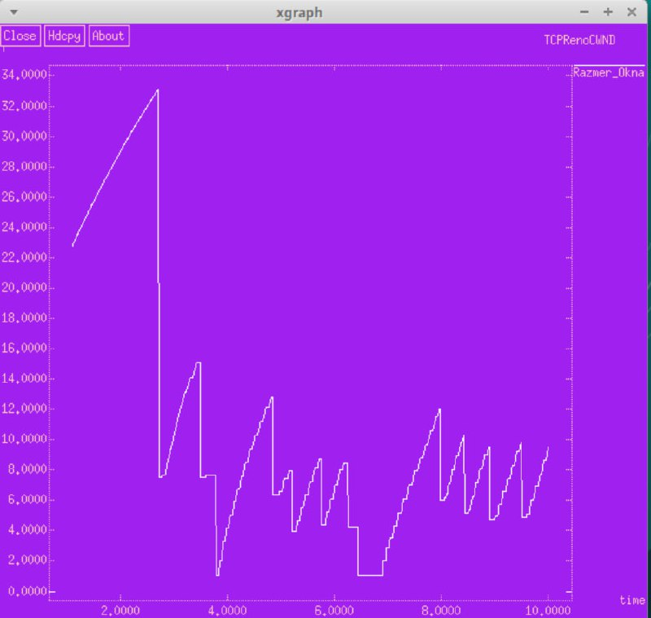{#fig:012 width=70%}

# Порядок выполнения

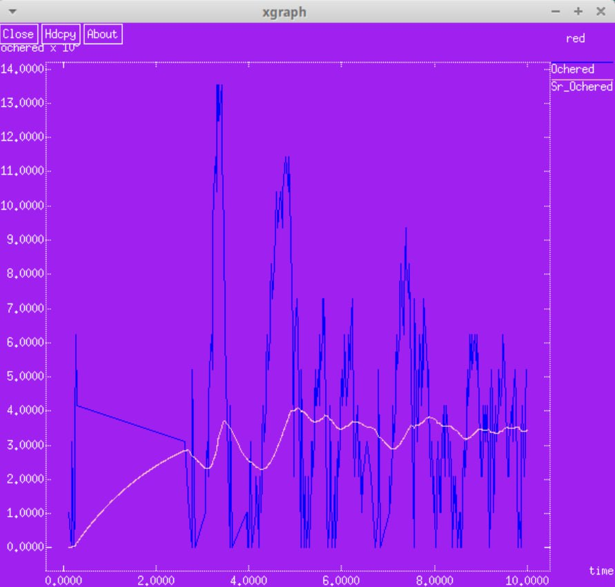{#fig:013 width=70%}

# Выводы

В процессе выполнения данной лабораторной работы я исследовала протокол TCP и алгоритм управления очередью RED.
