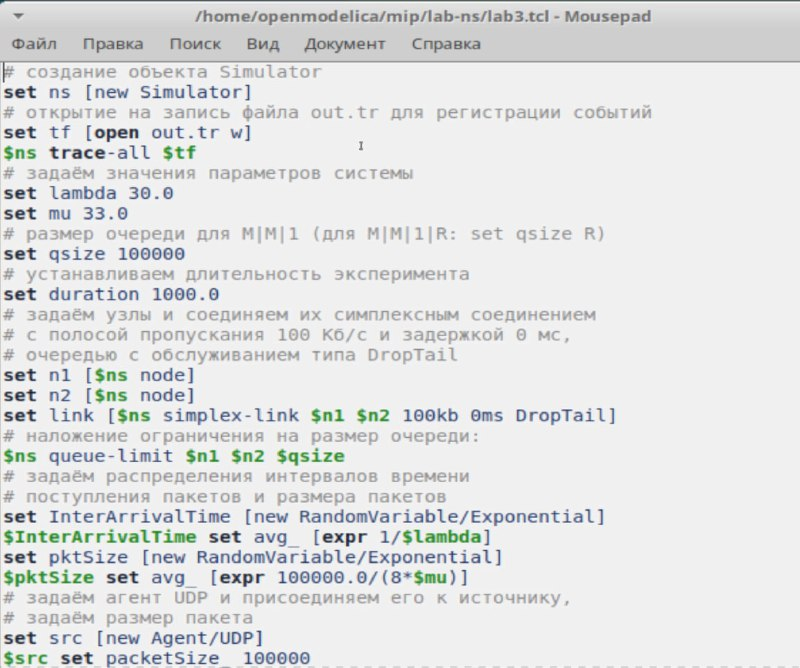
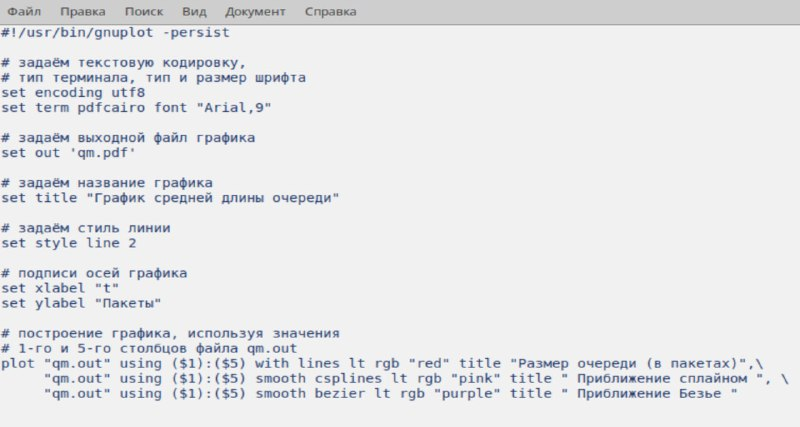
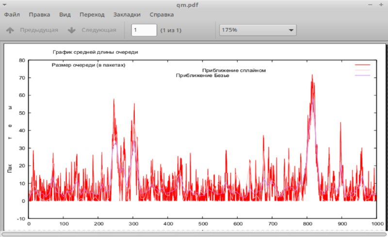

---
## Front matter
lang: ru-RU
title: Лабораторная работа №3
subtitle: Моделирование стохастических процессов
author:
  - Алиева Милена Арифовна
institute:
  - Российский университет дружбы народов, Москва, Россия

## i18n babel
babel-lang: russian
babel-otherlangs: english

## Formatting pdf
toc: false
toc-title: Содержание
slide_level: 2
aspectratio: 169
section-titles: true
theme: metropolis
header-includes:
 - \metroset{progressbar=frametitle,sectionpage=progressbar,numbering=fraction}
 - '\makeatletter'
 - '\beamer@ignorenonframefalse'
 - '\makeatother'
---

# Содержание 

1. Цель
2. Задания
3. Порядок выполнения
4. Вывод

# Цель работы

Провести моделирование системы массового обслуживания (СМО).

# Задание

1. Реализовать модель M|M|1;
2. Посчитать загрузку системы и вероятность потери пакетов;
3. Построить график изменения размера очереди.

# Порядок выполнения

1.  M|M|1 - это однолинейная СМО с накопителем бесконечной ёмкости. Поступающий поток заявок — пуассоновский с интенсивностью λ. Времена обслуживания заявок — независимые в совокупности случайные величины, распределённые по экспоненциальному закону с параметром μ. В данном сценарии также рассчитывается по формулам загрузка системы и вероятность потери пакетов. (рис. [-@fig:001]).

# Порядок выполнения

{#fig:001 width=70%}

# Порядок выполнения

2. Запустив эту программу, получим значения загрузки системы и вероятности потери пакетов (рис. [-@fig:002]).

{#fig:002 width=70%}

# Порядок выполнения

3. В каталоге с проектом создадим отдельный файл graph_plot (touch graph_plot). Откроем его на редактирование и добавим следующий код (рис. [-@fig:003]).

# Порядок выполнения

{#fig:003 width=70%}

# Порядок выполнения

4. Сделаем файл исполняемым, после компиляции файла с проектом, запустим скрипт в созданном файле graph_plot (рис. [-@fig:004]).

{#fig:004 width=70%}

# Порядок выполнения 

5. Увидим график поведения длины очереди, на нем изображен размер очереди в пакетах, а также его приближение сплайном и Безье. (рис. [-@fig:005]).

# Порядок выполнения

{#fig:005 width=70%}

# Выводы

В процессе выполнения данной лабораторной работы я провела моделирование системы массового обслуживания (СМО).

