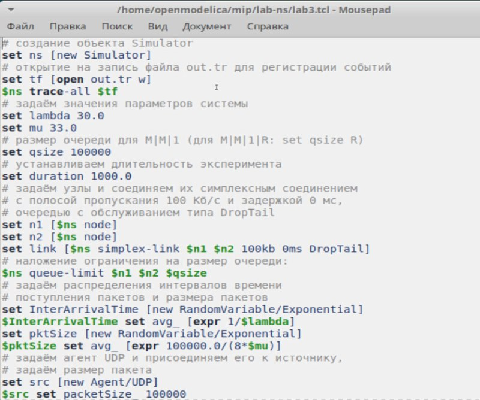
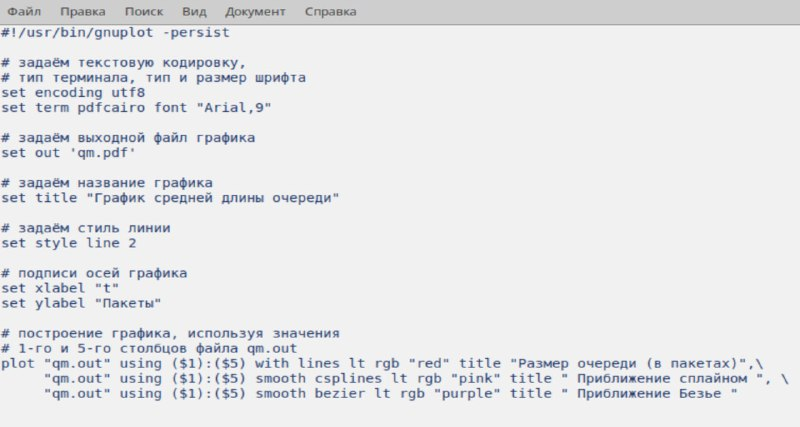
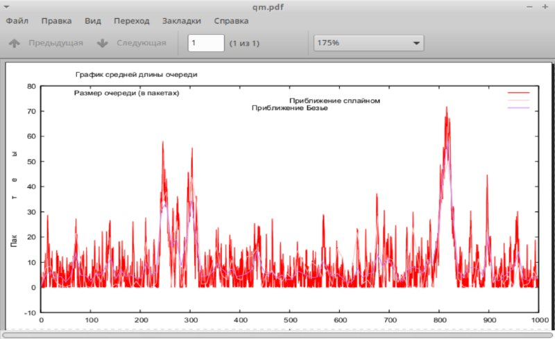

---
## Front matter
title: "Лабораторная работа №3"
subtitle: "Моделирование стохастических процессов"
author: "Алиева Милена Арифовна"

## Generic otions
lang: ru-RU
toc-title: "Содержание"

## Bibliography
bibliography: bib/cite.bib
csl: pandoc/csl/gost-r-7-0-5-2008-numeric.csl

## Pdf output format
toc: true # Table of contents
toc-depth: 2
lof: true # List of figures
lot: true # List of tables
fontsize: 12pt
linestretch: 1.5
papersize: a4
documentclass: scrreprt
## I18n polyglossia
polyglossia-lang:
  name: russian
  options:
  - spelling=modern
  - babelshorthands=true
polyglossia-otherlangs:
  name: english
## I18n babel
babel-lang: russian
babel-otherlangs: english
## Fonts
## Fonts
mainfont: PT Serif
romanfont: PT Serif
sansfont: PT Sans
monofont: PT Mono
mainfontoptions: Ligatures=TeX
romanfontoptions: Ligatures=TeX
sansfontoptions: Ligatures=TeX,Scale=MatchLowercase
monofontoptions: Scale=MatchLowercase,Scale=0.9
## Biblatex
biblatex: true
biblio-style: "gost-numeric"
biblatexoptions:
  - parentracker=true
  - backend=biber
  - hyperref=auto
  - language=auto
  - autolang=other*
  - citestyle=gost-numeric
## Pandoc-crossref LaTeX customization
figureTitle: "Рис."
tableTitle: "Таблица"
listingTitle: "Листинг"
lofTitle: "Список иллюстраций"
lotTitle: "Список таблиц"
lolTitle: "Листинги"
## Misc options
indent: true
header-includes:
  - \usepackage{indentfirst}
  - \usepackage{float} # keep figures where there are in the text
  - \floatplacement{figure}{H} # keep figures where there are in the text
---

# Цель работы

Провести моделирование системы массового обслуживания (СМО).

# Задание

1. Реализовать модель M|M|1;
2. Посчитать загрузку системы и вероятность потери пакетов;
3. Построить график изменения размера очереди.

# Выполнение лабораторной работы

1.  M|M|1 - это однолинейная СМО с накопителем бесконечной ёмкости. Поступающий поток заявок — пуассоновский с интенсивностью λ. Времена обслуживания заявок — независимые в совокупности случайные величины, распределённые по экспоненциальному закону с параметром μ. В данном сценарии также рассчитывается по формулам загрузка системы и вероятность потери пакетов. (рис. [-@fig:001]).

{#fig:001 width=70%}

2. Запустив эту программу, получим значения загрузки системы и вероятности потери пакетов (рис. [-@fig:002]).

{#fig:002 width=70%}

3. В каталоге с проектом создадим отдельный файл graph_plot (touch graph_plot). Откроем его на редактирование и добавим следующий код (рис. [-@fig:003]).

{#fig:003 width=70%}

4. Сделаем файл исполняемым, после компиляции файла с проектом, запустим скрипт в созданном файле graph_plot (рис. [-@fig:004]).

{#fig:004 width=70%}

5. Увидим график поведения длины очереди, на нем изображен размер очереди в пакетах, а также его приближение сплайном и Безье. (рис. [-@fig:005]).

{#fig:005 width=70%}

# Выводы

В процессе выполнения данной лабораторной работы я провела моделирование системы массового обслуживания (СМО).
