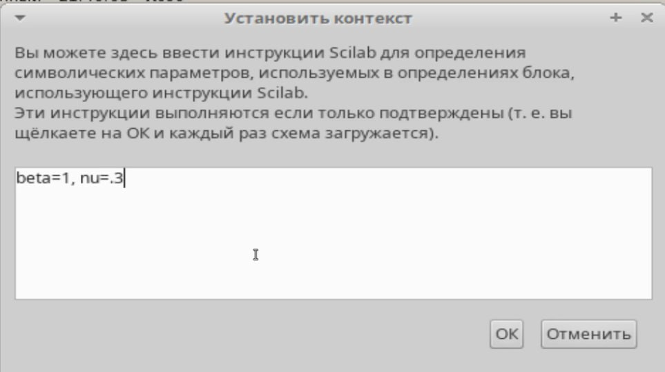
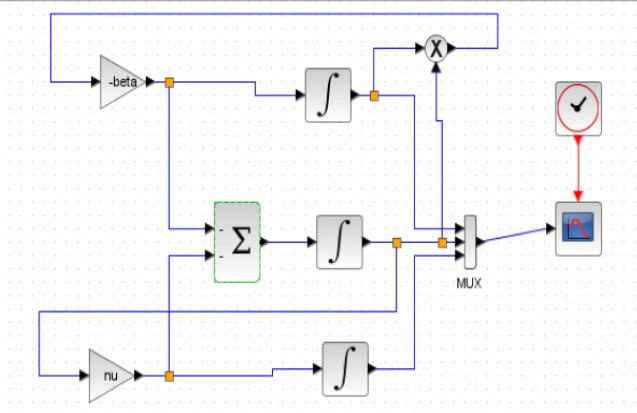
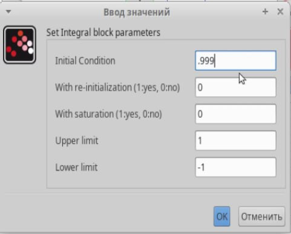
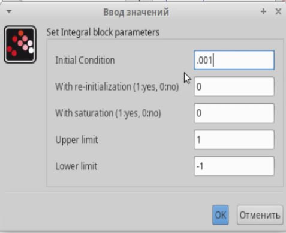
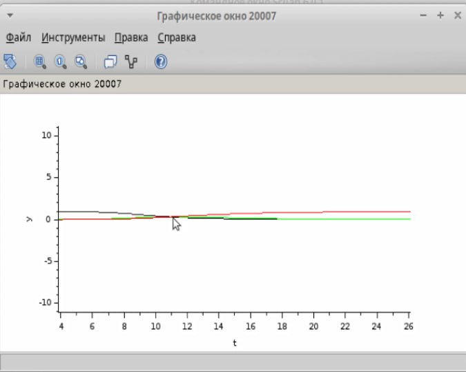
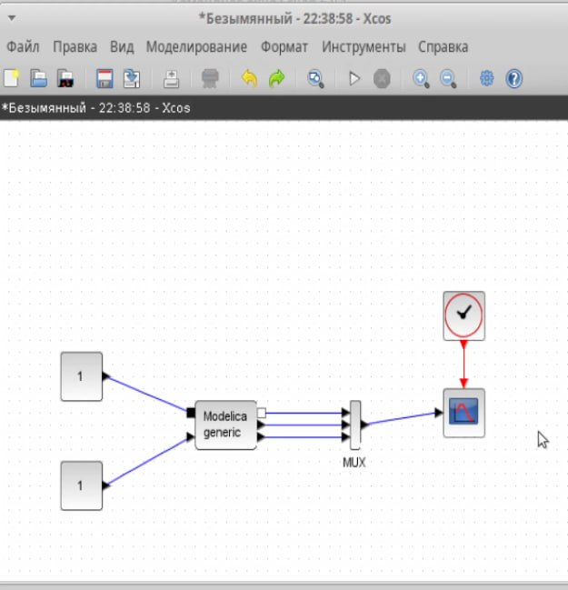
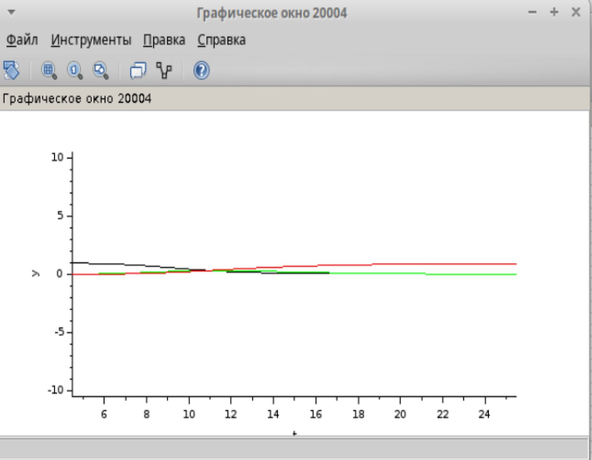

---
## Front matter
title: "Лабораторная работа №5"
subtitle: "Модель эпидемии (SIR)"
author: "Алиева Милена Арифовна"

## Generic otions
lang: ru-RU
toc-title: "Содержание"

## Bibliography
bibliography: bib/cite.bib
csl: pandoc/csl/gost-r-7-0-5-2008-numeric.csl

## Pdf output format
toc: true # Table of contents
toc-depth: 2
lof: true # List of figures
lot: true # List of tables
fontsize: 12pt
linestretch: 1.5
papersize: a4
documentclass: scrreprt
## I18n polyglossia
polyglossia-lang:
  name: russian
  options:
  - spelling=modern
  - babelshorthands=true
polyglossia-otherlangs:
  name: english
## I18n babel
babel-lang: russian
babel-otherlangs: english
## Fonts
## Fonts
mainfont: PT Serif
romanfont: PT Serif
sansfont: PT Sans
monofont: PT Mono
mainfontoptions: Ligatures=TeX
romanfontoptions: Ligatures=TeX
sansfontoptions: Ligatures=TeX,Scale=MatchLowercase
monofontoptions: Scale=MatchLowercase,Scale=0.9
## Biblatex
biblatex: true
biblio-style: "gost-numeric"
biblatexoptions:
  - parentracker=true
  - backend=biber
  - hyperref=auto
  - language=auto
  - autolang=other*
  - citestyle=gost-numeric
## Pandoc-crossref LaTeX customization
figureTitle: "Рис."
tableTitle: "Таблица"
listingTitle: "Листинг"
lofTitle: "Список иллюстраций"
lotTitle: "Список таблиц"
lolTitle: "Листинги"
## Misc options
indent: true
header-includes:
  - \usepackage{indentfirst}
  - \usepackage{float} # keep figures where there are in the text
  - \floatplacement{figure}{H} # keep figures where there are in the text
---

# Цель работы

Построить модель SIR в *xcos* и OpenModelica.

# Задание

1. Реализовать модель SIR в в *xcos*;
2. Реализовать модель SIR с помощью блока Modelica в *xcos*;
3. Реализовать модель SIR в OpenModelica;
4. Реализовать модель SIR с учётом процесса рождения / гибели особей в xcos (в том числе и с использованием блока Modelica), а также в OpenModelica;
5. Построить графики эпидемического порога при различных значениях параметров модели (в частности изменяя параметр $\mu$);
6. Сделать анализ полученных графиков в зависимости от выбранных значений параметров модели.

# Выполнение лабораторной работы

1. Зафиксируем начальные данные: $\beta = 1, \, \nu = 0,3, s(0) = 0,999, \, i(0) = 0,001, \, r(0) = 0.$

В меню Моделирование, Установить контекст зададим значения переменных $\beta$ и $\nu$ (рис. [-@fig:001]).

{#fig:001 width=70%}

2. Для реализации модели (рис. [-@fig:002]) потребуются следующие блоки xcos:

- `CLOCK_c` -- запуск часов модельного времени;
- `CSCOPE` -- регистрирующее устройство для построения графика;
- `TEXT_f` -- задаёт текст примечаний;
- `MUX` -- мультиплексер, позволяющий в данном случае вывести на графике сразу
несколько кривых;
- `INTEGRAL_m` -- блок интегрирования;
- `GAINBLK_f` -- в данном случае позволяет задать значения коэффициентов $\beta$ и $\nu$ ;
- `SUMMATION` -- блок суммирования;
- `PROD_f` -- поэлементное произведение двух векторов на входе блока.

{#fig:002 width=70%}

3. В параметрах верхнего и среднего блока интегрирования необходимо задать начальные значения $s(0) = 0,999$ и $i(0) = 0,001$ (рис. [-@fig:003],[-@fig:004]).

{#fig:003 width=70%}

{#fig:004 width=70%}

4. В меню "Моделирование -> Установка" зададим конечное время интегрирования, равным времени моделирования, в данном случае 30. Результат моделирования представлен на рис. [-@fig:006], где черной линией обозначен график $s(t)$ (динамика численности уязвимых к болезни особей), красная линия определяет $r(t)$ — динамику численности выздоровевших особей, зеленая линия определяет $i(t)$ — динамику численности заражённых особей. Пересечение трёх линий определяет порог эпидемии.

{#fig:005 width=70%}

5. Реализуем модель с помощью блока Modelica в xcos. Для реализации модели SIR с помощью языка Modelica помимо блоков `CLOCK_c`, `CSCOPE`, `TEXT_f` и `MUX` требуются блоки `CONST_m` — задаёт константу; `MBLOCK` (Modelica generic) — блок реализации кода на языке Modelica. Задаём значения переменных $\beta$ и $\nu$. Готовая модель SIR представлена на рис. [-@fig:006].

{#fig:006 width=70%}

В результате получаем график (рис. [-@fig:007]), построенный с помощью блока Modelica идентичный графику, построенному без них.

{#fig:007 width=70%}

# Выводы

В процессе выполнения лабораторной работы №5 я научилась строить модель SIR в *xcos* и OpenModelica

