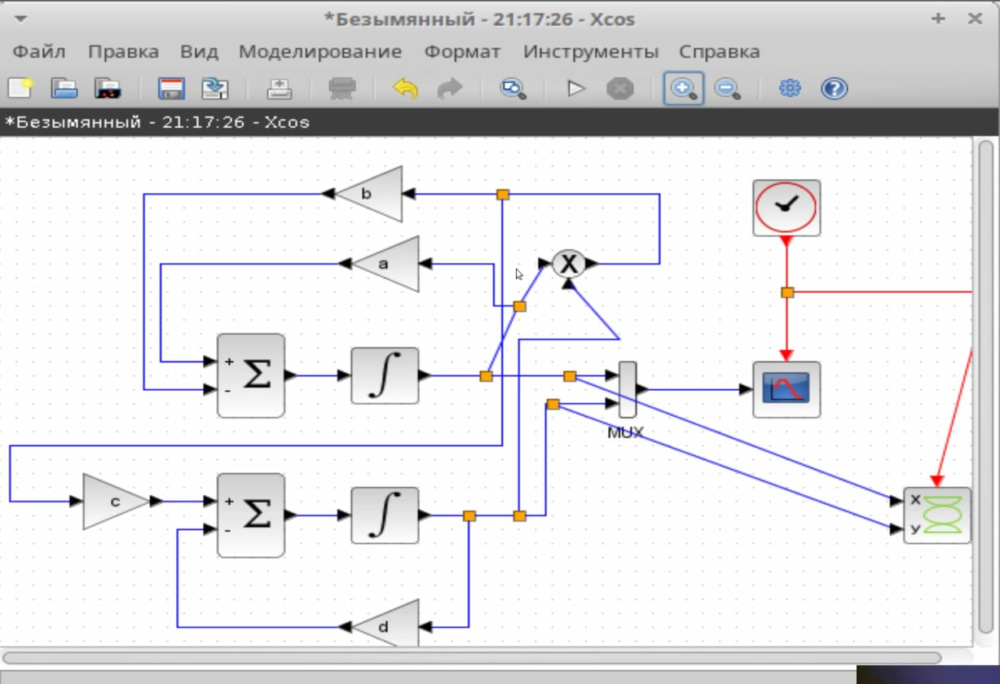
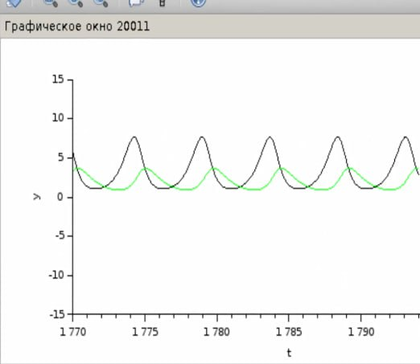
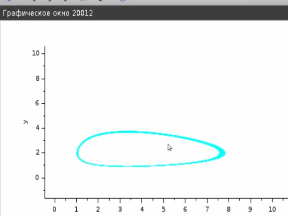
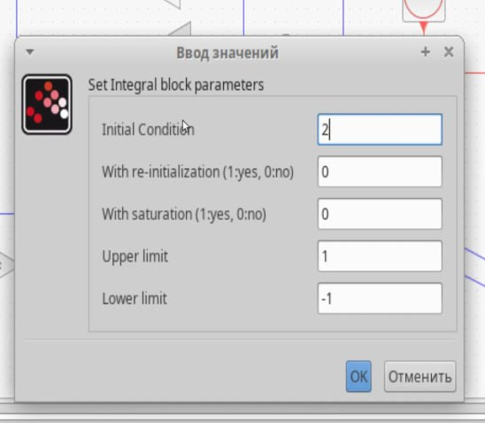
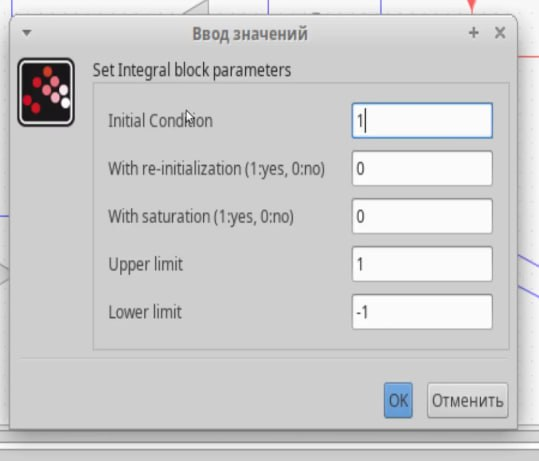
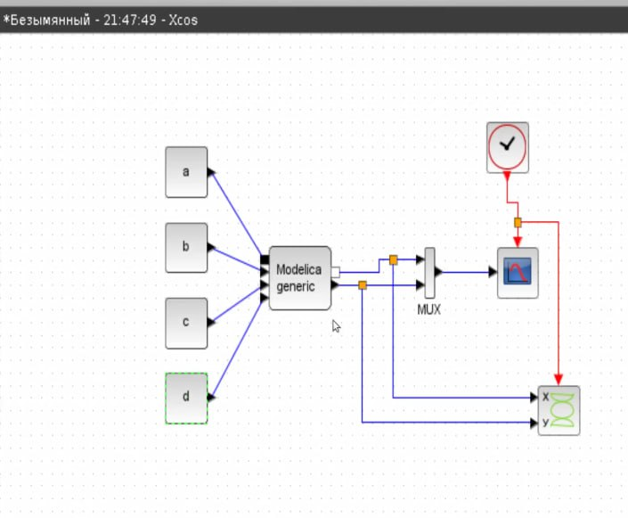
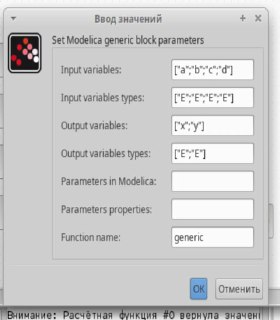
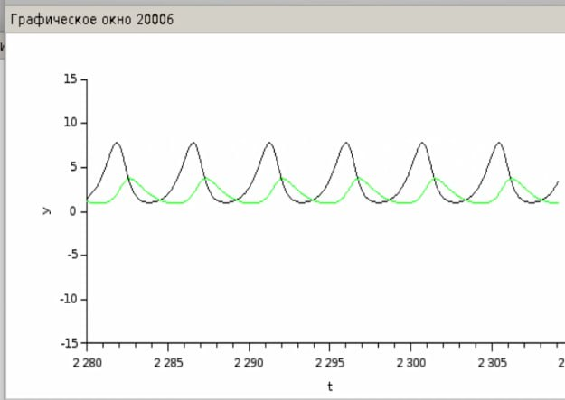
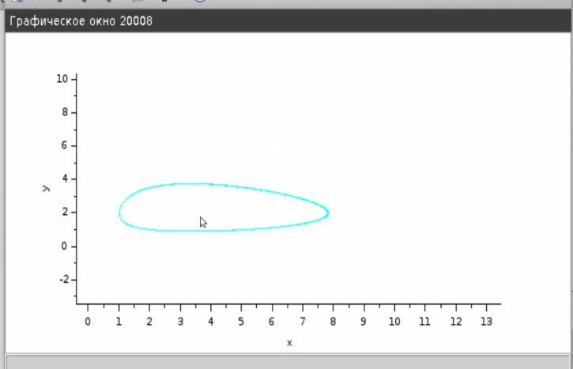
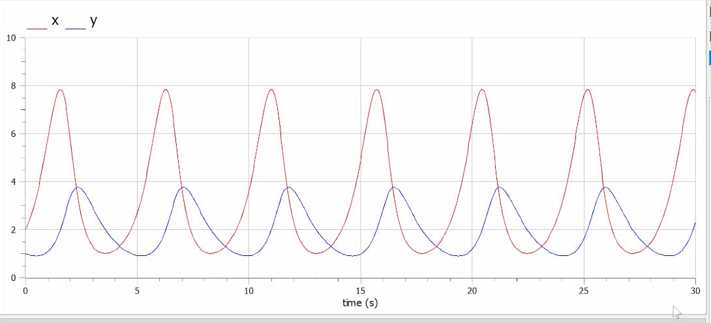

---
## Front matter
title: "Лабораторная работа №6"
subtitle: "Модель «хищник–жертва»"
author: "Алиева Милена Арифовна"

## Generic otions
lang: ru-RU
toc-title: "Содержание"

## Bibliography
bibliography: bib/cite.bib
csl: pandoc/csl/gost-r-7-0-5-2008-numeric.csl

## Pdf output format
toc: true # Table of contents
toc-depth: 2
lof: true # List of figures
lot: true # List of tables
fontsize: 12pt
linestretch: 1.5
papersize: a4
documentclass: scrreprt
## I18n polyglossia
polyglossia-lang:
  name: russian
  options:
  - spelling=modern
  - babelshorthands=true
polyglossia-otherlangs:
  name: english
## I18n babel
babel-lang: russian
babel-otherlangs: english
## Fonts
## Fonts
mainfont: PT Serif
romanfont: PT Serif
sansfont: PT Sans
monofont: PT Mono
mainfontoptions: Ligatures=TeX
romanfontoptions: Ligatures=TeX
sansfontoptions: Ligatures=TeX,Scale=MatchLowercase
monofontoptions: Scale=MatchLowercase,Scale=0.9
## Biblatex
biblatex: true
biblio-style: "gost-numeric"
biblatexoptions:
  - parentracker=true
  - backend=biber
  - hyperref=auto
  - language=auto
  - autolang=other*
  - citestyle=gost-numeric
## Pandoc-crossref LaTeX customization
figureTitle: "Рис."
tableTitle: "Таблица"
listingTitle: "Листинг"
lofTitle: "Список иллюстраций"
lotTitle: "Список таблиц"
lolTitle: "Листинги"
## Misc options
indent: true
header-includes:
  - \usepackage{indentfirst}
  - \usepackage{float} # keep figures where there are in the text
  - \floatplacement{figure}{H} # keep figures where there are in the text
---

# Цель работы

Реализовать модель "хищник-жертва" в *xcos*

# Задание

1. Реализовать модель "хищник-жертва" в xcos
2. Реализовать модель "хищник-жертва" с помощью блока Modelica в xcos
3. Реализовать модель "хищник-жертва" в OpenModelica

# Выполнение лабораторной работы

1. Модель «хищник–жертва» (модель Лотки — Вольтерры) представляет собой модель межвидовой конкуренции. В математической форме модель имеет вид:

$$
\begin{cases}
  \dot x = ax - bxy \\
  \dot y = cxy - dy,
\end{cases}
$$

где $x$ — количество жертв; $y$ — количество хищников; $a, b, c, d$ — коэффициенты, отражающие взаимодействия между видами: $a$ — коэффициент рождаемости
жертв; $b$ — коэффициент убыли жертв; $c$ — коэффициент рождения хищников; $d$ — коэффициент убыли хищников.
Зафиксируем начальные данные: $a = 2, \, b = 1, \, c = 0.3, \, d = 1, \, x(0) = 2, \, y(0) = 1$.
В меню Моделирование, Задать переменные окружения зададим значения коэффициентов $a, \, b, \, c, \, d$ (рис. [-@fig:001]).

{#fig:001 width=70%}

Для реализации модели "хищник-жертва" в дополнение к блокам `CLOCK_c`, `CSCOPE`, `TEXT_f`, `MUX`, `INTEGRAL_m`, `GAINBLK_f`, `SUMMATION`, `PROD_f` потребуется блок `CSCOPXY` -- регистрирующее устройство для построения фазового портрета. В параметрах блоков интегрирования необходимо задать начальные значения $x(0) = 2, y(0) = 1$. Готовая модель «хищник–жертва» представлена на рис. [-@fig:002].

{#fig:002 width=70%}

2. В меню Моделирование, Установка необходимо задать конечное время интегрирования, равным времени моделирования: 30.

Результат моделирования представлен на рис. [-@fig:003]. Черной линией обозначен график $x(t)$ (динамика численности жертв), зеленая линия определяет $y(t)$ — динамику численности хищников

{#fig:003 width=70%}

На рис. [-@fig:004] приведён фазовый портрет модели Лотки-Вольтерры.

{#fig:004 width=70%}

3. В параметрах верхнего и среднего блока интегрирования необходимо задать начальные значения $s(0) = 0,999$ и $i(0) = 0,001$ (рис. [-@fig:005],[-@fig:006]).

{#fig:005 width=70%}

{#fig:006 width=70%}

4. Реализуем модели с помощью блока Modelica в xcos. Для реализации модели с помощью языка Modelica потребуются следующиеблоки *xcos*: `CLOCK_c`, `CSCOPE`, `CSCOPXY`, `TEXT_f`, `MUX`, `CONST_m` и `MBLOCK`  (Modelica generic).

{#fig:007 width=70%}

{#fig:008 width=70%}

В результате моделирования получаем следующие графики (рис. [-@fig:009], [-@fig:010]). Они идентичны построенным без блока Modelica.

{#fig:009 width=70%}

{#fig:010 width=70%}

5. Реализуем модель «хищник – жертва» в OpenModelica. Построим графики изменения численности популяций и фазовый портрет.

```
  parameter Real a = 2;
  parameter Real b = 1;
  parameter Real c = 0.3;
  parameter Real d = 1;
  parameter Real x0 = 2;
  parameter Real y0 = 1;

  Real x(start=x0);
  Real y(start=y0);
equation
    der(x) = a*x - b*x*y;
    der(y) = c*x*y - d*y;
```

Выполним симуляцию, поставим конечное время 30с. Получим график изменения численности хищников и жертв (рис. [-@fig:011]).

{#fig:011 width=70%}


# Выводы

В процессе выполнения данной лабораторной реализована модель "хищник-жертва" в *xcos*.
