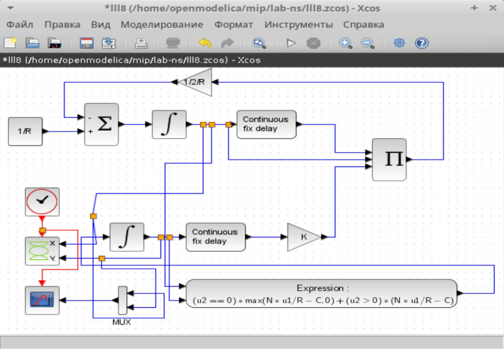
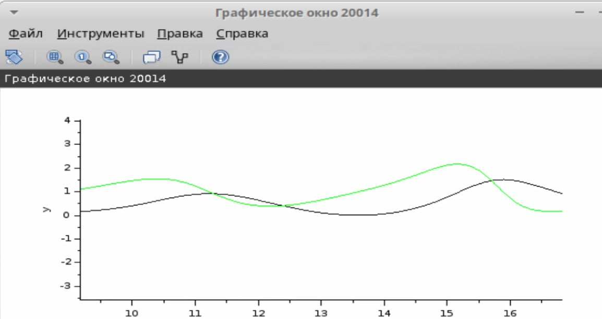
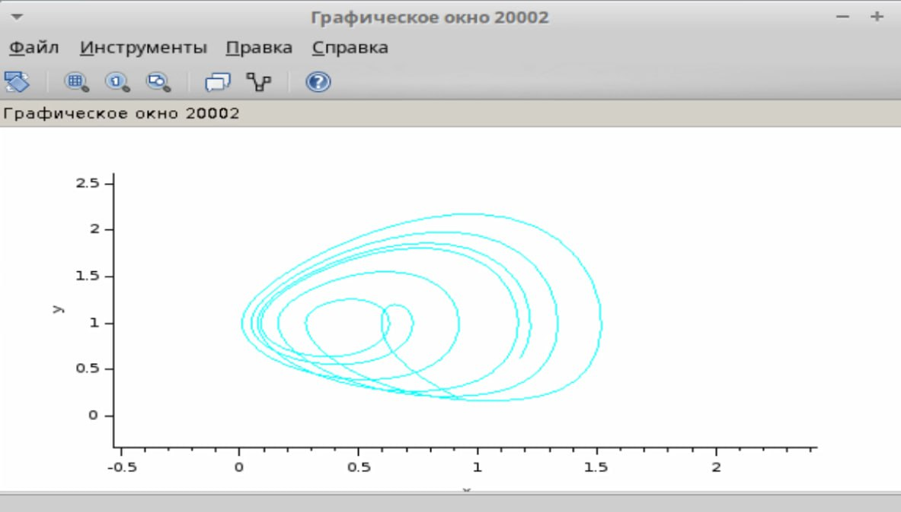
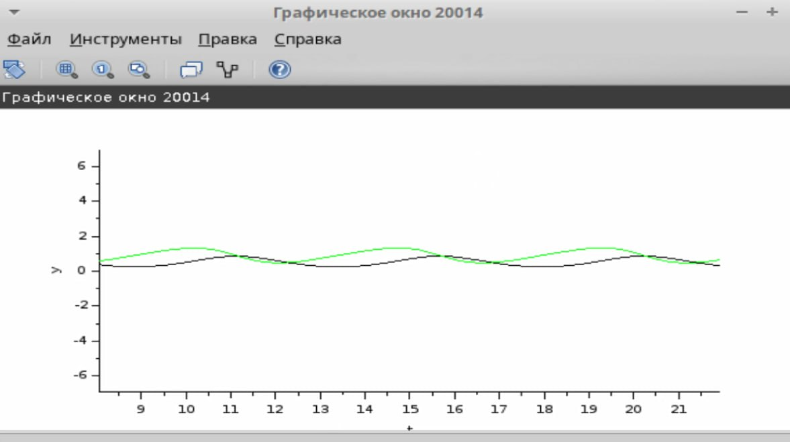
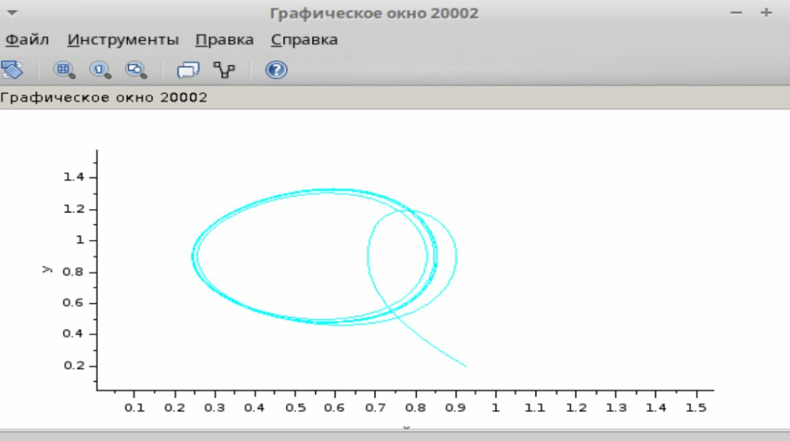
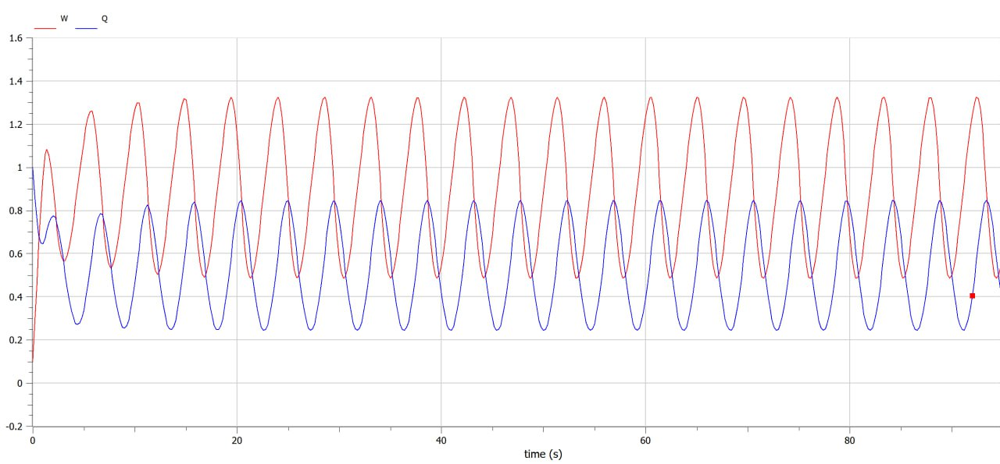
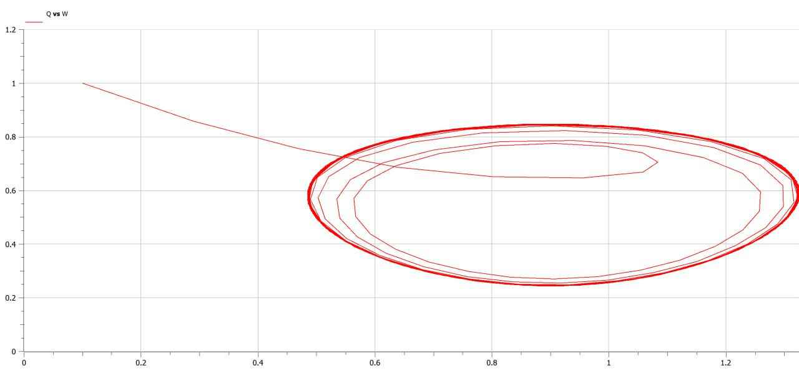

---
## Front matter
lang: ru-RU
title: Лабораторная работа №8
subtitle: Модель TCP/AQM
author:
  - Алиева Милена Арифовна
institute:
  - Российский университет дружбы народов, Москва, Россия

## i18n babel
babel-lang: russian
babel-otherlangs: english

## Formatting pdf
toc: false
toc-title: Содержание
slide_level: 2
aspectratio: 169
section-titles: true
theme: metropolis
header-includes:
 - \metroset{progressbar=frametitle,sectionpage=progressbar,numbering=fraction}
 - '\makeatletter'
 - '\beamer@ignorenonframefalse'
 - '\makeatother'
---

# Содержание 

1. Цель
2. Задания
3. Порядок выполнения
4. Вывод

# Цель работы

Реализовать модель TCP/AQM в xcos и OpenModelica.

# Задание

1. Построить модель TCP/AQM в xcos;
2. Построить графики динамики изменения размера TCP окна $W(t)$ и размера очереди $Q(t)$;
3. Построить модель TCP/AQM в OpenModelica;

# Порядок выполнения

1. Построим схему xcos, моделирующую нашу систему, с начальными значениями параметров $N = 1, R = 1, K = 5.3, C = 1, W(0) = 0.1, Q(0) = 1$. Для этого сначала зададим переменные окружения, а затем реализуем модель TCP/AQM, разместив блоки интегрирования, суммирования, произведения, констант, а также регистрирующие устройства (рис. [-@fig:001]):

# Порядок выполнения

{#fig:001 width=70%}

# Порядок выполнения

В результате получим динамику изменения размера TCP окна W(t) (зеленая линия на рисунке) и размера очереди Q(t) (черная линия на рисунке), видим довольно небольшие колебания, также получим фазовый портрет, который показывает наличие автоколебаний параметров системы — фазовая траектория осциллирует вокруг своей стационарной точки (рис. [-@fig:003], [-@fig:004]):

# Порядок выполнения

{#fig:002 width=70%}

# Порядок выполнения

{#fig:003 width=70%}

# Порядок выполнения

2. Теперь уменьшим скорость обработки пакетов $C$ до $0.9$ увидим, что автоколебания стали более выраженными (рис. [-@fig:004], [-@fig:005]).

# Порядок выполнения

{#fig:004 width=70%}

# Порядок выполнения

{#fig:005 width=70%}

# Порядок выполнения

3. Теперь сделаем задания для самостоятельного выполнения - перейдем к реализации модели в OpenModelica с начальным параметром С=0.9. Зададим параметры, начальные значения и систему уравнений.

# Порядок выполнения

```
parameter Real N=1;
parameter Real R=1;
parameter Real K=5.3;
parameter Real C=0.9;

Real W(start=0.1);
Real Q(start=1);

```

# Порядок выполнения

```
equation
der(W)= 1/R - W*delay(W, R)/(2*R)*K*delay(Q, R);
der(Q)= if (Q==0) then max(N*W/R-C,0) else (N*W/R-C);
```
# Порядок выполнения

Выполнив симуляцию, получим динамику изменения размера TCP окна W(t)(красная линия) и размера очереди Q(t)(синяя линия), а также фазовый портрет, который показывает наличие автоколебаний параметров системы — фазовая траектория осциллирует вокруг своей стационарной точки (рис. [-@fig:006], [-@fig:007]).

# Порядок выполнения

{#fig:006 width=70%}

# Порядок выполнения

{#fig:007 width=70%}

# Выводы

В процессе выполнения данной лабораторной работы я реализовала модель TCP/AQM в xcos и OpenModelica.
