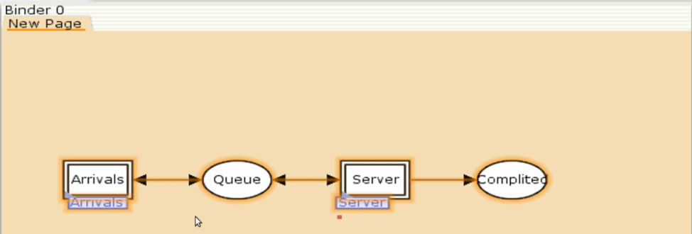
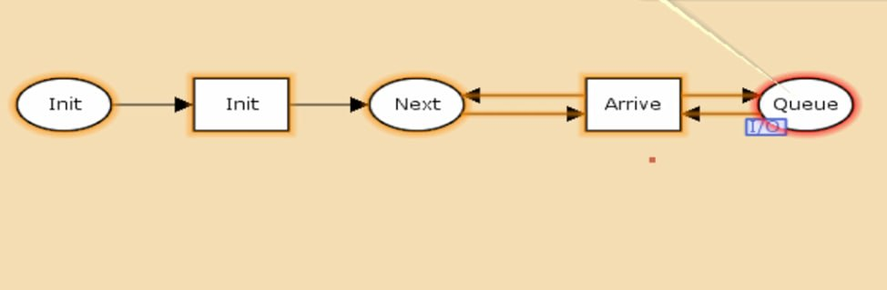
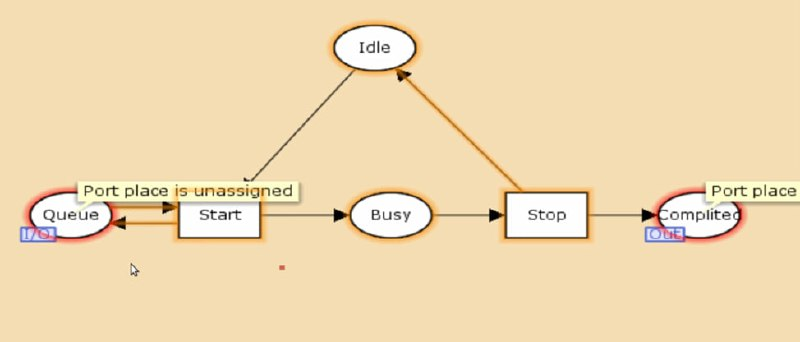
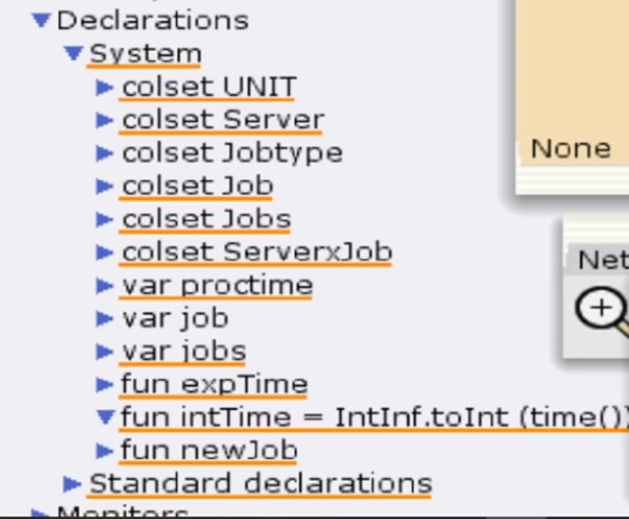
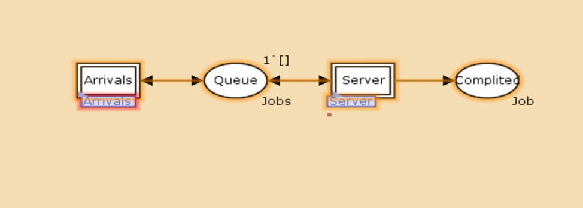
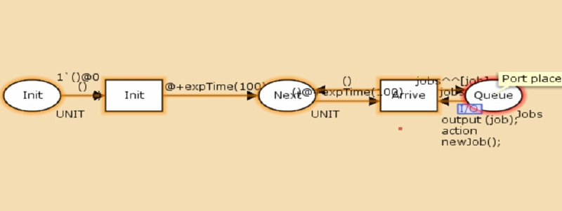
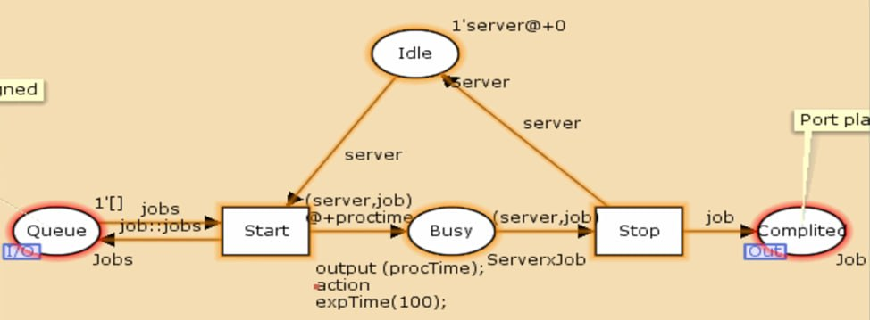

---
## Front matter
lang: ru-RU
title: Лабораторная работа №11
subtitle: Модель системы массового обслуживания M|M|1
author:
  - Алиева Милена Арифовна
institute:
  - Российский университет дружбы народов, Москва, Россия

## i18n babel
babel-lang: russian
babel-otherlangs: english

## Formatting pdf
toc: false
toc-title: Содержание
slide_level: 2
aspectratio: 169
section-titles: true
theme: metropolis
header-includes:
 - \metroset{progressbar=frametitle,sectionpage=progressbar,numbering=fraction}
 - '\makeatletter'
 - '\beamer@ignorenonframefalse'
 - '\makeatother'
---

# Содержание 

1. Цель
2. Задания
3. Порядок выполнения
4. Вывод

# Цель работы

Построить модель системы массового обслуживания с помощью CPNTools

# Задание

В систему поступает поток заявок двух типов, распределённый по пуассоновскому
закону. Заявки поступают в очередь сервера на обработку. Дисциплина очереди -
FIFO. Если сервер находится в режиме ожидания (нет заявок на сервере), то заявка поступает на обработку сервером.

# Порядок выполнения

1. Будем использовать три отдельных листа: на первом листе опишем граф системы, на втором — генератор заявок, на третьем — сервер обработки
заявок.
Начнём с графа системы: сеть имеет 2 позиции (очередь — Queue, обслуженные заявки — Complited) и два перехода, которые имеют сложную иерархическую структуру. (рис. [-@fig:001])

# Порядок выполнения

{#fig:001 width=70%}

# Порядок выполнения

Составим граф генератора заявок:

{#fig:002 width=70%}

# Порядок выполнения

Также составим граф процесса обработки заявок на сервере имеет 4 позиции (Busy — сервер занят, Idle — сервер в режиме ожидания, Queue и Complited из листа System) и 2 перехода (Start — начать обработку заявки, Stop — закончить обработку заявки). (рис. [-@fig:003])

# Порядок выполнения

{#fig:003 width=70%}

# Порядок выполнения

2. Зададим декларации системы (рис. [-@fig:004] 

{#fig:004 width=70%}

# Порядок выполнения

3. Зададим параметры модели на графах сети.
На листе System:

# Порядок выполнения

{#fig:005 width=70%}

# Порядок выполнения

Зададим параметры на листе генератора заявок:

# Порядок выполнения

{#fig:006 width=70%}

# Порядок выполнения

Зададим параметры на листе Server (рис. [-@fig:007])

# Порядок выполнения

{#fig:007 width=70%}

# Выводы

В процессе выполнения данной лабораторной работы я построила модель системы массового обслуживания с помощью CPNTools.
