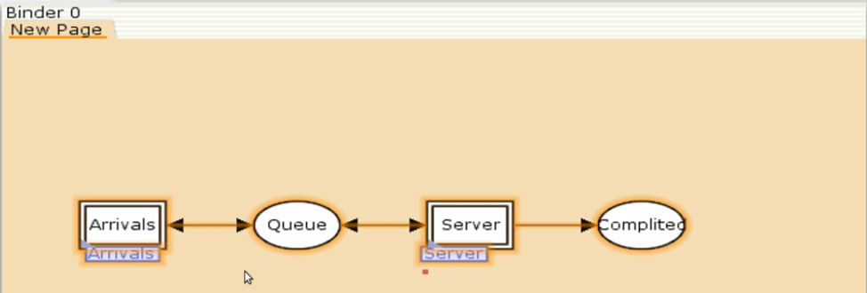
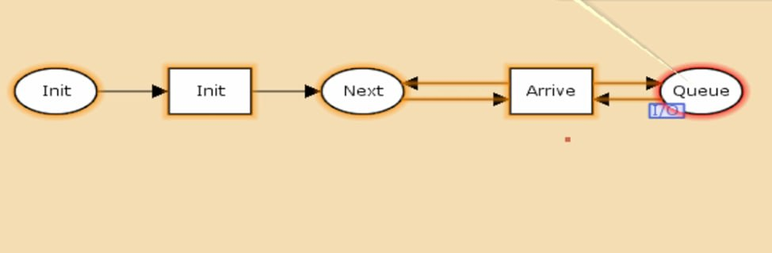
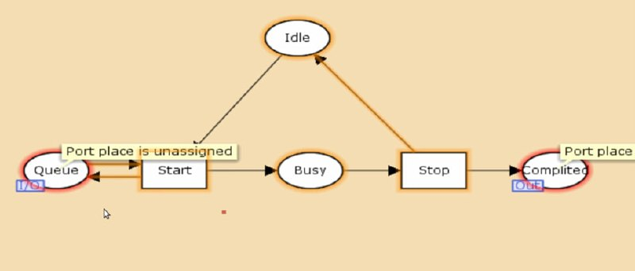
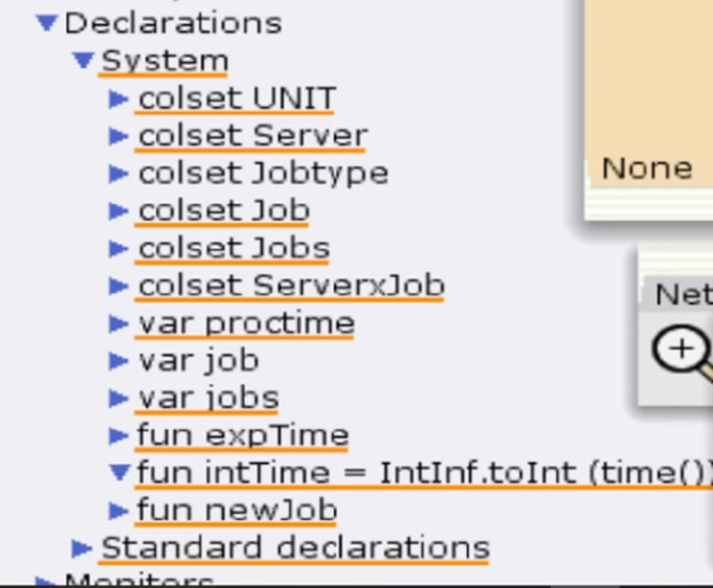
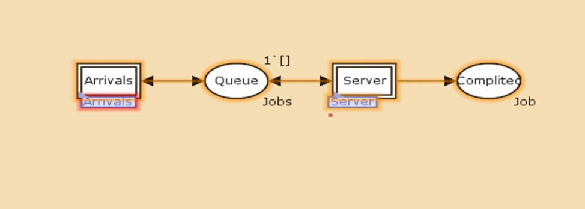
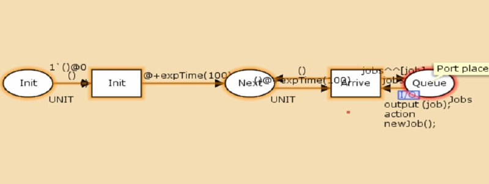
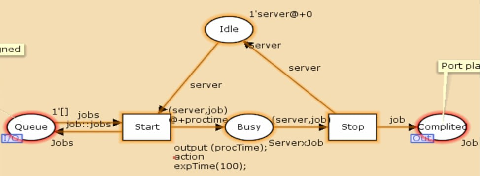

---
## Front matter
title: "Лабораторная работа №11"
subtitle: "Модель системы массового обслуживания M|M|1"
author: "Алиева Милена Арифовна"

## Generic otions
lang: ru-RU
toc-title: "Содержание"

## Bibliography
bibliography: bib/cite.bib
csl: pandoc/csl/gost-r-7-0-5-2008-numeric.csl

## Pdf output format
toc: true # Table of contents
toc-depth: 2
lof: true # List of figures
lot: true # List of tables
fontsize: 12pt
linestretch: 1.5
papersize: a4
documentclass: scrreprt
## I18n polyglossia
polyglossia-lang:
  name: russian
  options:
  - spelling=modern
  - babelshorthands=true
polyglossia-otherlangs:
  name: english
## I18n babel
babel-lang: russian
babel-otherlangs: english
## Fonts
## Fonts
mainfont: PT Serif
romanfont: PT Serif
sansfont: PT Sans
monofont: PT Mono
mainfontoptions: Ligatures=TeX
romanfontoptions: Ligatures=TeX
sansfontoptions: Ligatures=TeX,Scale=MatchLowercase
monofontoptions: Scale=MatchLowercase,Scale=0.9
## Biblatex
biblatex: true
biblio-style: "gost-numeric"
biblatexoptions:
  - parentracker=true
  - backend=biber
  - hyperref=auto
  - language=auto
  - autolang=other*
  - citestyle=gost-numeric
## Pandoc-crossref LaTeX customization
figureTitle: "Рис."
tableTitle: "Таблица"
listingTitle: "Листинг"
lofTitle: "Список иллюстраций"
lotTitle: "Список таблиц"
lolTitle: "Листинги"
## Misc options
indent: true
header-includes:
  - \usepackage{indentfirst}
  - \usepackage{float} # keep figures where there are in the text
  - \floatplacement{figure}{H} # keep figures where there are in the text
---

# Цель работы

Построить модель системы массового обслуживания с помощью CPNTools.

# Задание

В систему поступает поток заявок двух типов, распределённый по пуассоновскому
закону. Заявки поступают в очередь сервера на обработку. Дисциплина очереди -
FIFO. Если сервер находится в режиме ожидания (нет заявок на сервере), то заявка поступает на обработку сервером.

# Выполнение лабораторной работы

1. Будем использовать три отдельных листа: на первом листе опишем граф системы, на втором — генератор заявок, на третьем — сервер обработки
заявок.
Начнём с графа системы: сеть имеет 2 позиции (очередь — Queue, обслуженные заявки — Complited) и два перехода, которые имеют сложную иерархическую структуру. (рис. [-@fig:001])

{#fig:001 width=70%}

Составим граф генератора заявок, он имеет 3 позиции (текущая заявка — Init, следующая заявка — Next, очередь — Queue из листа System) и 2 перехода (Init — определяет распределение поступления заявок по экспоненциальному закону с интенсивностью 100 заявок в единицу времени, Arrive — определяет поступление заявок в очередь). (рис. [-@fig:002])

{#fig:002 width=70%}

Также составим граф процесса обработки заявок на сервере имеет 4 позиции (Busy — сервер занят, Idle — сервер в режиме ожидания, Queue и Complited из листа System) и 2 перехода (Start — начать обработку заявки, Stop — закончить обработку заявки). (рис. [-@fig:003])

{#fig:003 width=70%}

2. Зададим декларации системы (рис. [-@fig:004] 

{#fig:004 width=70%}

3. Зададим параметры модели на графах сети.
На листе System:
– у позиции Queue множество цветов фишек — Jobs; начальная маркировка 1`[]
определяет, что изначально очередь пуста.
– у позиции Completed множество цветов фишек — Job. (рис. [-@fig:005])

{#fig:005 width=70%}

Зададим параметры на листе генератора заявок 
– у позиции Init: множество цветов фишек — UNIT; начальная маркировка 1`()@0
определяет, что поступление заявок в систему начинается с нулевого момента
времени;
– у позиции Next: множество цветов фишек — UNIT;
– на дуге от позиции Init к переходу Init выражение () задаёт генерацию заявок;
– на дуге от переходов Init и Arrive к позиции Next выражение
()@+expTime(100) задаёт экспоненциальное распределение времени между
поступлениями заявок;
– на дуге от позиции Next к переходу Arrive выражение () задаёт перемещение
фишки;
– на дуге от перехода Arrive к позиции Queue выражение jobs^^[job] задает
поступление заявки в очередь;
– на дуге от позиции Queue к переходу Arrive выражение jobs задаёт обратную
связь. (рис. [-@fig:006])

{#fig:006 width=70%}

Зададим параметры на листе Server (рис. [-@fig:007])

{#fig:007 width=70%}

# Выводы

В процессе выполнения данной лабораторной работы я построила модель системы массового обслуживания с помощью CPNTools.
