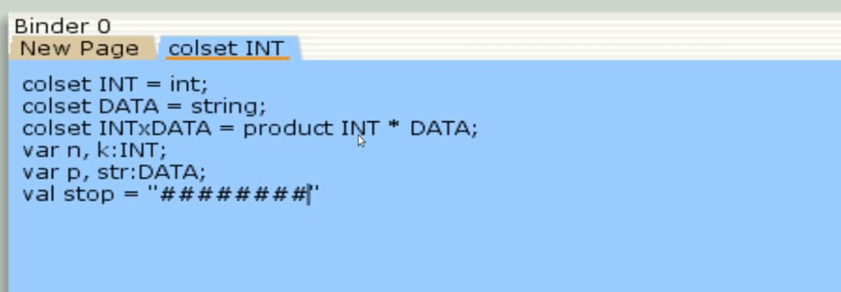
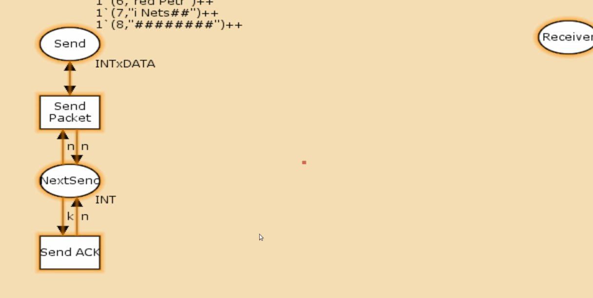
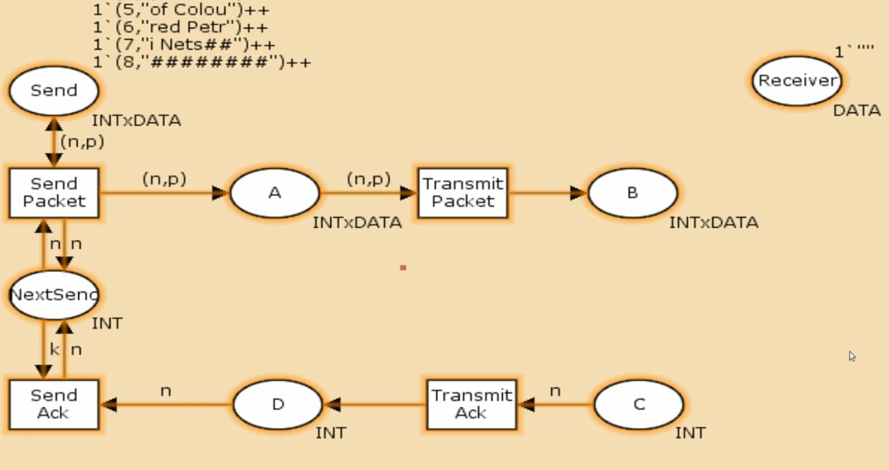
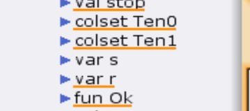
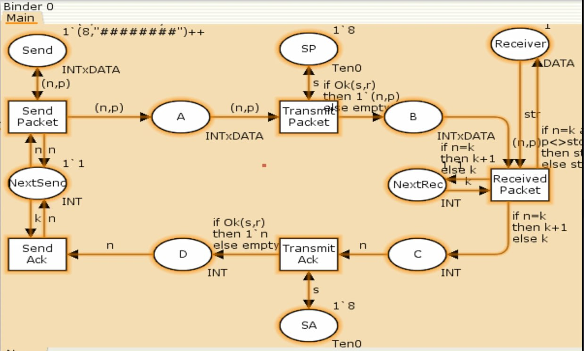
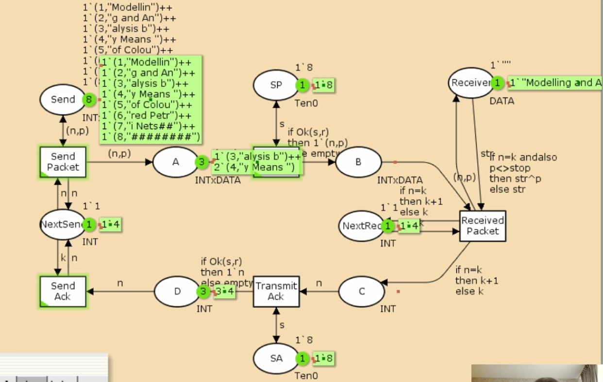

---
## Front matter
lang: ru-RU
title: Лабораторная работа №12
subtitle: Пример моделирования простого протокола передачи данных
author:
  - Алиева Милена Арифовна
institute:
  - Российский университет дружбы народов, Москва, Россия

## i18n babel
babel-lang: russian
babel-otherlangs: english

## Formatting pdf
toc: false
toc-title: Содержание
slide_level: 2
aspectratio: 169
section-titles: true
theme: metropolis
header-includes:
 - \metroset{progressbar=frametitle,sectionpage=progressbar,numbering=fraction}
 - '\makeatletter'
 - '\beamer@ignorenonframefalse'
 - '\makeatother'
---

# Содержание 

1. Цель
2. Задания
3. Порядок выполнения
4. Вывод

# Цель работы

Реализовать простой протокол передачи данных в CPN Tools.

# Задание

Реализовать простой протокол передачи данных в CPN Tools.

# Порядок выполнения

Основные состояния: источник (Send), получатель (Receiver).
Действия (переходы): отправить пакет (Send Packet), отправить подтверждение
(Send ACK).
Промежуточное состояние: следующий посылаемый пакет (NextSend).
Зададим декларации модели: (рис. [-@fig:001])

# Порядок выполнения

{#fig:001 width=70%}

# Порядок выполнения

Построим начальный граф (рис. [-@fig:002])

{#fig:002 width=70%}

# Порядок выполнения

Зададим промежуточные состояния (A, B с типом INTxDATA, C, D с типом INTxDATA) для переходов: передать пакет Transmit Packet (передаём (n,p)), передать подтверждение Transmit ACK (передаём целое число k). Добавляем переход получения пакета (Receive Packet) (рис. [-@fig:003])

# Порядок выполнения

{#fig:003 width=70%}

# Порядок выполнения

В декларациях задаём: (рис. [-@fig:004])

# Порядок выполнения

{#fig:004 width=70%}

# Порядок выполнения

Таким образом, получим модель простого протокола передачи данных.
Пакет последовательно проходит: состояние Send, переход Send Packet, состояние A, с некоторой вероятностью переход Transmit Packet, состояние B, попадает на переход Receive Packet, где проверяется номер пакета и если нет совпадения, то пакет направляется в состояние Received, а номер пакета передаётся последовательно в состояние C, с некоторой вероятностью в переход Transmit ACK, далее в состояние D, переход Receive ACK, состояние NextSend (увеличивая на 1 номер следующего пакета), переход Send Packet. Так продолжается до тех пор, пока не будут переданы все части сообщения. Последней будет передана стоппоследовательность. (рис. [-@fig:005])

# Порядок выполнения

{#fig:005 width=70%}

# Порядок выполнения

Сохраним модель и перезапустим. Увидим, что всё отображается корректно, запустим (рис. [-@fig:006])

# Порядок выполнения

{#fig:006 width=70%}

# Порядок выполнения

Отчёт о пространстве состояний:

```

 Statistics
------------------------------------------------------------------------

  State Space
     Nodes:  13341
     Arcs:   206461
     Secs:   300
     Status: Partial
     
```

# Порядок выполнения

```
Best Integer Bounds
                             Upper      Lower
     Main'A 1                20         0
     Main'B 1                10         0
     Main'C 1                6          0
     Main'D 1                5          0
     Main'NextRec 1          1          1
     Main'NextSend 1         1          1
     Main'Reciever 1         1          1
     Main'SA 1               1          1
     Main'SP 1               1          1
     Main'Send 1             8          8
```
# Порядок выполнения

Видим, что у нас 13341 состояний и 206461 переходов между ними. Можем также проанализировать границы значений для промежуточных состояний A, B, C - наибольшая верхняя граница у A, затем у состояния B верхняя граница - 10. У вспомогательных состояний SP, SA, NextRec, NextSend, Receiver - 1, так как в них может находиться только один пакет, в состоянии Send - 8, так как в нем хранится только 8 элементов, как мы задавали в начале (никаких изменений с ним не происходило).

# Выводы

В процессе выполнения данной лабораторной работы я реализовала простой протокол передачи данных в CPN Tools и провела анализ его пространства состояний.
