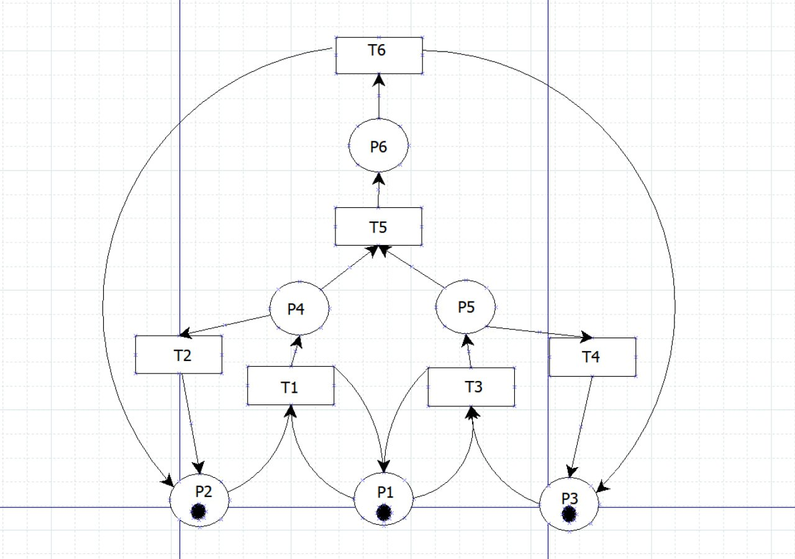
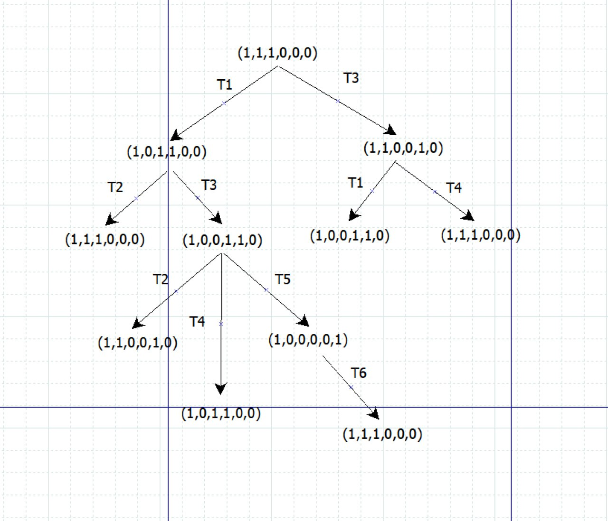
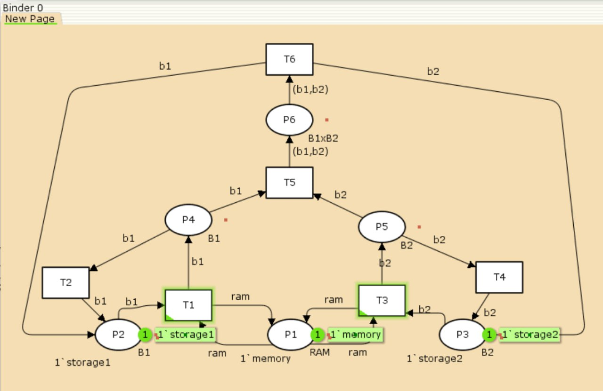
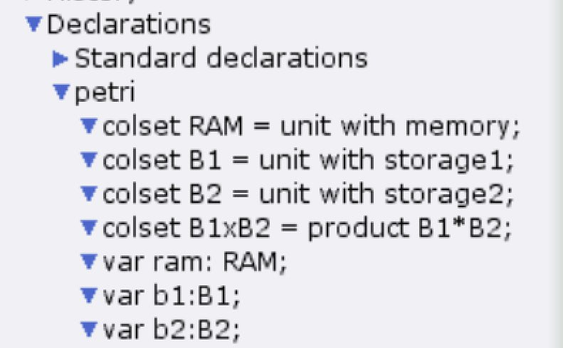
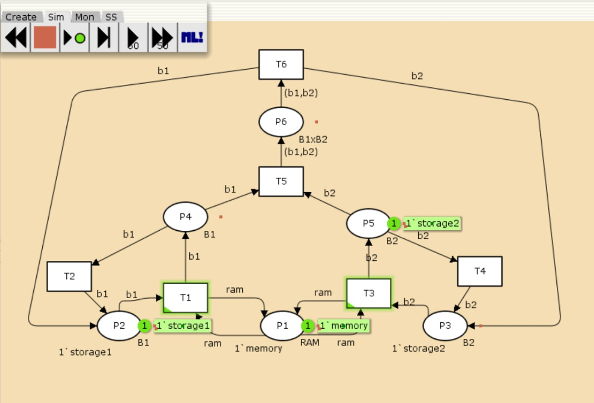
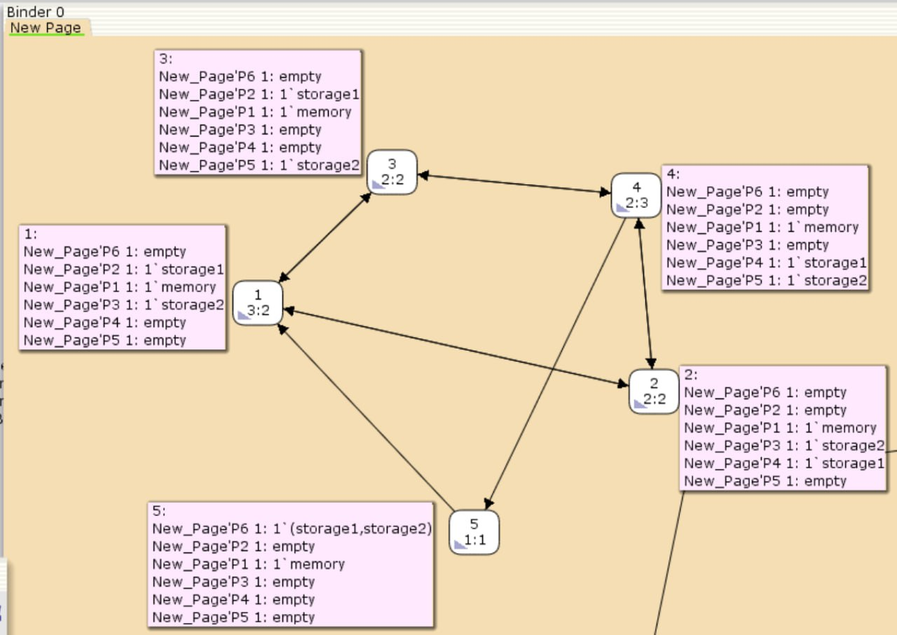

---
## Front matter
lang: ru-RU
title: Лабораторная работа №13
subtitle: Задание для самостоятельного выполнения
author:
  - Алиева Милена Арифовна
institute:
  - Российский университет дружбы народов, Москва, Россия

## i18n babel
babel-lang: russian
babel-otherlangs: english

## Formatting pdf
toc: false
toc-title: Содержание
slide_level: 2
aspectratio: 169
section-titles: true
theme: metropolis
header-includes:
 - \metroset{progressbar=frametitle,sectionpage=progressbar,numbering=fraction}
 - '\makeatletter'
 - '\beamer@ignorenonframefalse'
 - '\makeatother'
---

# Содержание 

1. Цель
2. Задания
3. Порядок выполнения 
4. Вывод

# Цель работы

Выполнить задание для самостоятельной работы 

# Задание

1. Используя теоретические методы анализа сетей Петри, провести анализ сети (с помощью построения дерева достижимости). Определить, является ли сеть безопасной, ограниченной, сохраняющей, имеются ли
тупики.
2. Промоделировать сеть Петри с помощью CPNTools.
3. Вычислить пространство состояний. Сформировать отчёт о пространстве состояний и проанализировать его.Построить граф пространства состояний.

# Порядок выполнения

1. Нам представлена схема модели: заявка (команды программы, операнды) поступает в оперативную память (ОП), затем
передается на прибор (центральный процессор, ЦП) для обработки. После этого
заявка может равновероятно обратиться к оперативной памяти или к одному из двух
внешних запоминающих устройств (B1 и B2). Прежде чем записать информацию на
внешний накопитель, необходимо вторично обратиться к центральному процессору,
определяющему состояние накопителя и выдающему необходимую управляющую
информацию. Накопители (B1 и B2) могут работать в 3-х режимах:

1) B1 — занят, B2 — свободен;
2) B2 — свободен, B1 — занят;
3) B1 — занят, B2 — занят.

# Порядок выполнения

{#fig:001 width=70%}

# Порядок выполнения

Построим дерево достижимости (рис. [-@fig:002]).

{#fig:002 width=70%}

# Порядок выполнения

Видим, что представленная сеть: безопасна (так как в каждой позиции количество фишек не превышает 1, ограничена (так как существует такое целое k, что число
фишек в каждой позиции не может превысить k, у нас k=1), сеть не является сохраняющей (так как при переходах t5 и t6 количество фишек меняется) и сеть не имеет тупиков (так как состояние устройств восстанавливается при срабатывании RAM — переходов T1 или T2; B1 — переходов T2 или T6; B2 — переходов T4 или T6).

# Порядок выполнения

2. Реализуем модель в CPN Tools. С помощью контекстного меню создаем новую сеть, далее нам понадобятся 6 позиций и 6 блоков переходов, затем их нужно соединить, а также задать параметры и начальные значения (рис. [-@fig:003]).

# Порядок выполнения

{#fig:003 width=70%}

# Порядок выполнения

Также зададим нужные декларации (рис. [-@fig:004]):

{#fig:004 width=70%}

# Порядок выполнения

Запустим модель (рис. [-@fig:005]):

{#fig:005 width=70%}

# Порядок выполнения

3. Далее сформируем граф пространства состояний, их всего 5. Для этого сначала мы сформировали код пространства состояний, затем применили "Вычислить пространство состояний" к листу, содержащему страницу сети ([-@fig:006]).

{#fig:006 width=70%}

# Порядок выполнения

Затем сформировали отчёт о пространстве состояний, сохранили его:

# Порядок выполнения

```
CPN Tools state space report for:
/home/openmodelica/Downloads/petri_net(1).cpn
Report generated: Sat May  3 16:20:38 2025


 Statistics
------------------------------------------------------------------------

  State Space
     Nodes:  5
     Arcs:   10
     Secs:   0
     Status: Full

  Scc Graph
     Nodes:  1
     Arcs:   0
     Secs:   0
     
```

# Порядок выполнения

```
Boundedness Properties
------------------------------------------------------------------------

  Best Integer Bounds
                             Upper      Lower
     New_Page'P1 1           1          1
     New_Page'P2 1           1          0
     New_Page'P3 1           1          0
     New_Page'P4 1           1          0
     New_Page'P5 1           1          0
     New_Page'P6 1           1          0
```

# Порядок выполнения

Видим, что у нас есть 5 состояний и 10 переходов между ними. Границы значений для каждого элемента: состояние P1 всегда заполнено 1 элементом, а остальные содержат максимум 1 элемент, минимум 0. Также можем заметить маркировку home для всех состояний, так как в любую позицию мы можем попасть из любой другой маркировки, а маркировка dead равная None означает, что нет состояний, из которых переходов быть не может. Отметим, что состояние T5 необходимо для того, чтобы система не попадала в тупик, а состояние T6 происходит всегда, если доступно.

# Выводы

В процессе выполнения данной лабораторной работы я провела анализ сети Петри, построила сеть в CPN Tools, построила граф состояний и провела его анализ.


