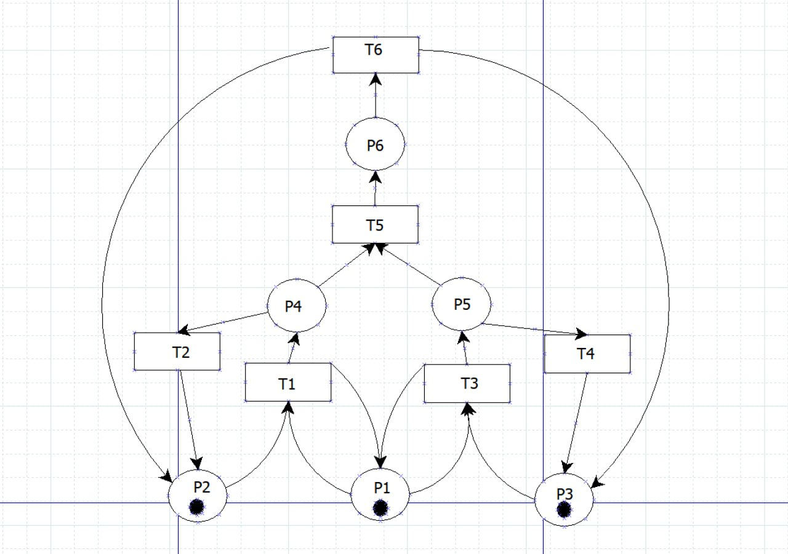
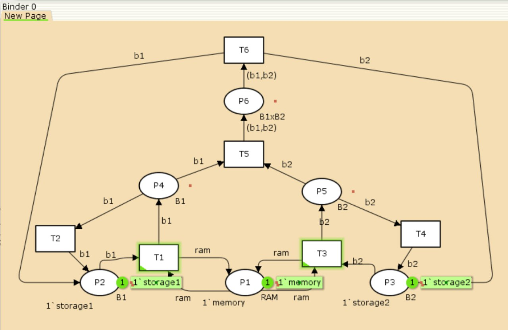
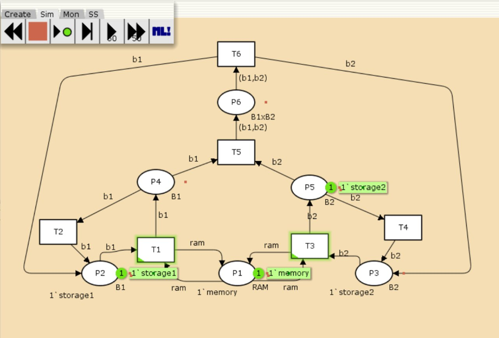
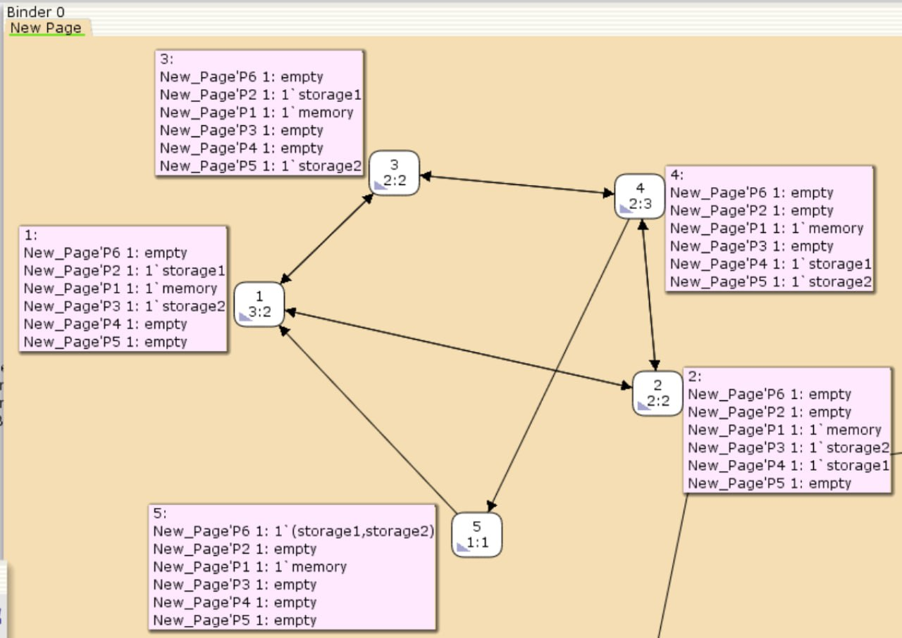

---
## Front matter
title: "Лабораторная работа №13"
subtitle: "Задание для самостоятельного выполнения"
author: "Алиева Милена Арифовна"

## Generic otions
lang: ru-RU
toc-title: "Содержание"

## Bibliography
bibliography: bib/cite.bib
csl: pandoc/csl/gost-r-7-0-5-2008-numeric.csl

## Pdf output format
toc: true # Table of contents
toc-depth: 2
lof: true # List of figures
lot: true # List of tables
fontsize: 12pt
linestretch: 1.5
papersize: a4
documentclass: scrreprt
## I18n polyglossia
polyglossia-lang:
  name: russian
  options:
  - spelling=modern
  - babelshorthands=true
polyglossia-otherlangs:
  name: english
## I18n babel
babel-lang: russian
babel-otherlangs: english
## Fonts
## Fonts
mainfont: PT Serif
romanfont: PT Serif
sansfont: PT Sans
monofont: PT Mono
mainfontoptions: Ligatures=TeX
romanfontoptions: Ligatures=TeX
sansfontoptions: Ligatures=TeX,Scale=MatchLowercase
monofontoptions: Scale=MatchLowercase,Scale=0.9
## Biblatex
biblatex: true
biblio-style: "gost-numeric"
biblatexoptions:
  - parentracker=true
  - backend=biber
  - hyperref=auto
  - language=auto
  - autolang=other*
  - citestyle=gost-numeric
## Pandoc-crossref LaTeX customization
figureTitle: "Рис."
tableTitle: "Таблица"
listingTitle: "Листинг"
lofTitle: "Список иллюстраций"
lotTitle: "Список таблиц"
lolTitle: "Листинги"
## Misc options
indent: true
header-includes:
  - \usepackage{indentfirst}
  - \usepackage{float} # keep figures where there are in the text
  - \floatplacement{figure}{H} # keep figures where there are in the text
---

# Цель работы

Выполнить задание для самостоятельной работы [@lab]

# Задание

1. Используя теоретические методы анализа сетей Петри, провести анализ сети (с помощью построения дерева достижимости). Определить, является ли сеть безопасной, ограниченной, сохраняющей, имеются ли
тупики.
2. Промоделировать сеть Петри с помощью CPNTools.
3. Вычислить пространство состояний. Сформировать отчёт о пространстве состояний и проанализировать его.Построить граф пространства состояний.

# Выполнение лабораторной работы

1. Нам представлена схема модели: заявка (команды программы, операнды) поступает в оперативную память (ОП), затем
передается на прибор (центральный процессор, ЦП) для обработки. После этого
заявка может равновероятно обратиться к оперативной памяти или к одному из двух
внешних запоминающих устройств (B1 и B2). Прежде чем записать информацию на
внешний накопитель, необходимо вторично обратиться к центральному процессору,
определяющему состояние накопителя и выдающему необходимую управляющую
информацию. Накопители (B1 и B2) могут работать в 3-х режимах:

1) B1 — занят, B2 — свободен;
2) B2 — свободен, B1 — занят;
3) B1 — занят, B2 — занят.


Сеть Петри моделируемой системы представлена на рис. [-@fig:001].

Множество позиций:

P1 — состояние оперативной памяти (свободна / занята);

P2 — состояние внешнего запоминающего устройства B1 (свободно / занято);

P3 — состояние внешнего запоминающего устройства B2 (свободно / занято);

P4 — работа на ОП и B1 закончена;

P5 — работа на ОП и B2 закончена;

P6 — работа на ОП, B1 и B2 закончена;

Множество переходов:

T1 — ЦП работает только с RAM и B1;

T2 — обрабатываются данные из RAM и с B1 переходят на устройство вывода;

T3 — CPU работает только с RAM и B2;

T4 — обрабатываются данные из RAM и с B2 переходят на устройство вывода;

T5 — CPU работает только с RAM и с B1, B2;

T6 — обрабатываются данные из RAM, B1, B2 и переходят на устройство вывода.

Функционирование сети Петри можно расматривать как срабатывание переходов,
в ходе которого происходит перемещение маркеров по позициям:

- работа CPU с RAM и B1 отображается запуском перехода T1 (удаление маркеров
из P1, P2 и появление в P1, P4), что влечет за собой срабатывание перехода T2,
т.е. передачу данных с RAM и B1 на устройство вывода;
- работа CPU с RAM и B2 отображается запуском перехода T3 (удаление маркеров
из P1 и P3 и появление в P1 и P5), что влечет за собой срабатывание перехода T4,
т.е. передачу данных с RAM и B2 на устройство вывода;
- работа CPU с RAM, B1 и B2 отображается запуском перехода T5 (удаление
маркеров из P4 и P5 и появление в P6), далее срабатывание перехода T6, и данные
из RAM, B1 и B2 передаются на устройство вывода;
- состояние устройств восстанавливается при срабатывании: RAM — переходов
T1 или T2; B1 — переходов T2 или T6; B2 — переходов T4 или T6.

{#fig:001 width=70%}

2. Чтобы выполнить задание, построим дерево достижимости (рис. [-@fig:002]).

{#fig:002 width=70%}

Видим, что представленная сеть: безопасна (так как в каждой позиции количество фишек не превышает 1, ограничена (так как существует такое целое k, что число
фишек в каждой позиции не может превысить k, у нас k=1), сеть не является сохраняющей (так как при переходах t5 и t6 количество фишек меняется) и сеть не имеет тупиков (так как состояние устройств восстанавливается при срабатывании RAM — переходов T1 или T2; B1 — переходов T2 или T6; B2 — переходов T4 или T6).

3. Реализуем модель в CPN Tools. С помощью контекстного меню создаем новую сеть, далее нам понадобятся 6 позиций и 6 блоков переходов, затем их нужно соединить, а также задать параметры и начальные значения (рис. [-@fig:003]).

{#fig:003 width=70%}

Также зададим нужные декларации (рис. [-@fig:004]):

{#fig:004 width=70%}

Запустим модель (рис. [-@fig:005]):

{#fig:005 width=70%}

4. Далее сформируем граф пространства состояний, их всего 5. Для этого сначала мы сформировали код пространства состояний, затем применили "Вычислить пространство состояний" к листу, содержащему страницу сети ([-@fig:006]).

{#fig:006 width=70%}

Затем сформировали отчёт о пространстве состояний, сохранили его:

```
CPN Tools state space report for:
/home/openmodelica/Downloads/petri_net(1).cpn
Report generated: Sat May  3 16:20:38 2025


 Statistics
------------------------------------------------------------------------

  State Space
     Nodes:  5
     Arcs:   10
     Secs:   0
     Status: Full

  Scc Graph
     Nodes:  1
     Arcs:   0
     Secs:   0


 Boundedness Properties
------------------------------------------------------------------------

  Best Integer Bounds
                             Upper      Lower
     New_Page'P1 1           1          1
     New_Page'P2 1           1          0
     New_Page'P3 1           1          0
     New_Page'P4 1           1          0
     New_Page'P5 1           1          0
     New_Page'P6 1           1          0

  Best Upper Multi-set Bounds
     New_Page'P1 1       1`memory
     New_Page'P2 1       1`storage1
     New_Page'P3 1       1`storage2
     New_Page'P4 1       1`storage1
     New_Page'P5 1       1`storage2
     New_Page'P6 1       1`(storage1,storage2)

  Best Lower Multi-set Bounds
     New_Page'P1 1       1`memory
     New_Page'P2 1       empty
     New_Page'P3 1       empty
     New_Page'P4 1       empty
     New_Page'P5 1       empty
     New_Page'P6 1       empty


 Home Properties
------------------------------------------------------------------------

  Home Markings
     All


 Liveness Properties
------------------------------------------------------------------------

  Dead Markings
     None

  Dead Transition Instances
     None

  Live Transition Instances
     All


 Fairness Properties
------------------------------------------------------------------------
       New_Page'T1 1          No Fairness
       New_Page'T2 1          No Fairness
       New_Page'T3 1          No Fairness
       New_Page'T4 1          No Fairness
       New_Page'T5 1          Just
       New_Page'T6 1          Fair
```
       
Видим, что у нас есть 5 состояний и 10 переходов между ними. Границы значений для каждого элемента: состояние P1 всегда заполнено 1 элементом, а остальные содержат максимум 1 элемент, минимум 0. Также можем заметить маркировку home для всех состояний, так как в любую позицию мы можем попасть из любой другой маркировки, а маркировка dead равная None означает, что нет состояний, из которых переходов быть не может. Отметим, что состояние T5 необходимо для того, чтобы система не попадала в тупик, а состояние T6 происходит всегда, если доступно.

# Выводы

В процессе выполнения данной лабораторной работы я провела анализ сети Петри, построила сеть в CPN Tools, построила граф состояний и провела его анализ.

# Список литературы 

