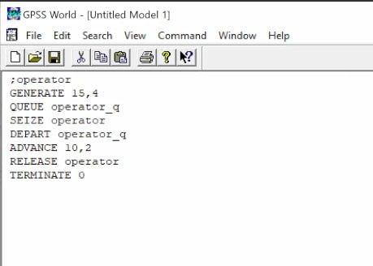

---
## Front matter
lang: ru-RU
title: Лабораторная работа №14
subtitle: Модели обработки заказов
author:
  - Алиева Милена Арифовна
institute:
  - Российский университет дружбы народов, Москва, Россия

## i18n babel
babel-lang: russian
babel-otherlangs: english

## Formatting pdf
toc: false
toc-title: Содержание
slide_level: 2
aspectratio: 169
section-titles: true
theme: metropolis
header-includes:
 - \metroset{progressbar=frametitle,sectionpage=progressbar,numbering=fraction}
 - '\makeatletter'
 - '\beamer@ignorenonframefalse'
 - '\makeatother'
---

# Содержание 

1. Цель
2. Задания
3. Порядок выполнения 
4. Вывод

# Цель работы

Реализовать модели обработки заказов и провести анализ результатов

# Задание

Реализовать с помощью gpss модель оформления заказов клиентов одним оператором, построить гистограмму распределения заявок в очереди, реализовать модель обслуживания двух типов заказов от клиентов в интернет-магазине, реализовать модель оформления заказов несколькими операторами

# Порядок выполнения

1. Порядок блоков в модели соответствует порядку фаз обработки заказа в реальной системе:
1) клиент оставляет заявку на заказ в интернет-магазине;
2) если необходимо, заявка от клиента ожидает в очереди освобождения оператора для оформления заказа;
3) заявка от клиента принимается оператором для оформления заказа;
4) оператор оформляет заказ;
5) клиент получает подтверждение об оформлении заказа (покидает систему).

# Порядок выполнения

Таким образом, получаем модель (рис. [-@fig:001])

{#fig:001 width=70%}

# Порядок выполнения

После запуска симуляции получаем отчёт (рис. [-@fig:002])

{#fig:002 width=70%}

# Порядок выполнения

Далее для выполнения упражнения необходимо скорректировать модель в соответствии с изменениями входных данных: интервалы поступления заказов распределены равномерно с интервалом 3.14 ± 1.7 мин; время оформления заказа также распределено равномерно на интервале 6.66 ± 1.7 мин

# Порядок выполнения

Изменим интервалы поступления заказов и время оформления клиентов (рис. [-@fig:003])

{#fig:003 width=70%}

# Порядок выполнения

После запуска симуляции получаем отчёт (рис. [-@fig:004])

{#fig:004 width=70%}

# Порядок выполнения

2. Далее требуется построить гистограмму распределения заявок, ожидающих обработки в очереди в примере из предыдущего упражнения

# Порядок выполнения

{#fig:005 width=70%}

# Порядок выполнения

Получим отчет симуляции и проанализируем его (рис. [-@fig:006]).

{#fig:006 width=70%}

# Порядок выполнения

Проанализируем гистограмму (рис. [-@fig:007]).

{#fig:007 width=50%}

Частотность разделена на 15 частотных интервалов с шагом 2 и началом в 0, как мы и задали. Наибольшее количество заявок - 17 - обрабатывалось 10-12 минут, 14 заявок - 12-14 минут, 12 заявок - 8-10 минут, в остальных диапазонах 0-4 заявок. 

# Порядок выполнения

3. Необходимо реализовать отличие в оформлении обычных заказов и заказов с дополнительным пакетом услуг. Такую систему можно промоделировать с помощью двух сегментов. Один из них моделирует оформление обычных заказов, а второй - заказов с дополнительным пакетом услуг. В каждом из сегментов пара `QUEUE–DEPART` должна описывать одну и ту же очередь, а пара блоков `SEIZE–RELEASE` должна описывать в каждом из двух сегментов одно и то же устройство и моделировать работу оператора.

# Порядок выполнения

{#fig:008 width=70%}

# Порядок выполнения

Отчёт по модели (рис. [-@fig:009]).

{#fig:009 width=70%}

# Порядок выполнения

Скорректируем модель так, чтобы учитывалось условие, что число заказов с дополнительным пакетом услуг составляет 30% от общего числа заказов

# Порядок выполнения

{#fig:010 width=70%}

# Порядок выполнения

Проанализируем результаты моделирования (рис. [-@fig:011]).

{#fig:011 width=70%}

# Порядок выполнения

4. Реализуем последнюю модель - в интернет-магазине заказы принимают 4 оператора. Интервалы поступления заказов распределены равномерно с интервалом $5 \pm 2$ мин. Время оформления заказа каждым оператором также распределено равномерно на интервале $10 \pm 2$ мин. обработка поступивших заказов происходит в порядке очереди (FIFO). Требуется определить характеристики очереди заявок на оформление заказов при условии, что заявка может обрабатываться одним из 4-х операторов в течение восьмичасового рабочего дня

# Порядок выполнения

С помощью строки `operator STORAGE 4` указываем, что у нас 4 оператора, затем к обычной процедуре генерации и обработки заявки добавляется, что заявку обрабатывает один оператор `operator,1`, сегмент моделирования времени остается без изменений (рис. [-@fig:012]).

{#fig:012 width=60%}

# Порядок выполнения

Далее получим и проанализируем отчет (рис. [-@fig:013]).

{#fig:013 width=70%}

# Порядок выполнения

Далее в упражнении изменим модель: требуется учесть в ней возможные отказы клиентов от заказа - когда при подаче заявки на заказ клиент видит в очереди более двух других заявок, он отказывается от подачи заявки, то есть отказывается от обслуживания (используем блок `TEST` и стандартный числовой атрибут Qj текущей длины очереди j).

# Порядок выполнения

{#fig:014 width=70%}

# Порядок выполнения

Проанализируем полученный отчет (рис. [~@fig:015]).

{#fig:015 width=70%}

# Выводы

В процессе выполнения данной лабораторной работы я реализовала с помощью gpss модель оформления заказов клиентов одним оператором, построила гистограмму распределения заявок в очереди, реализовала модель обслуживания двух типов заказов от клиентов в интернет-магазине, реализовала модель оформления заказов несколькими операторами

