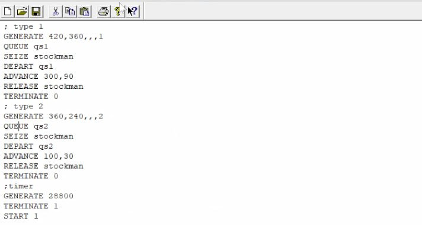
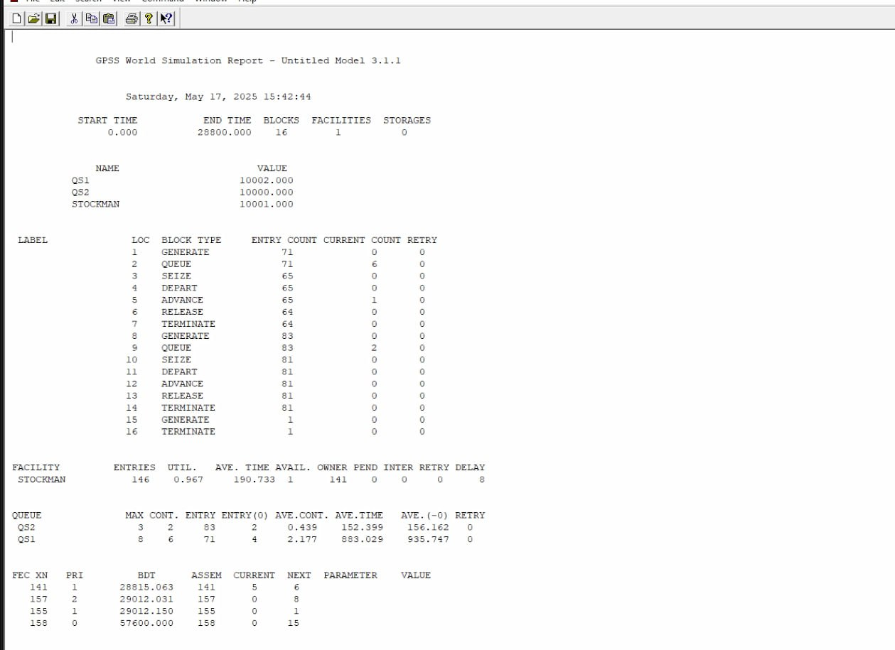
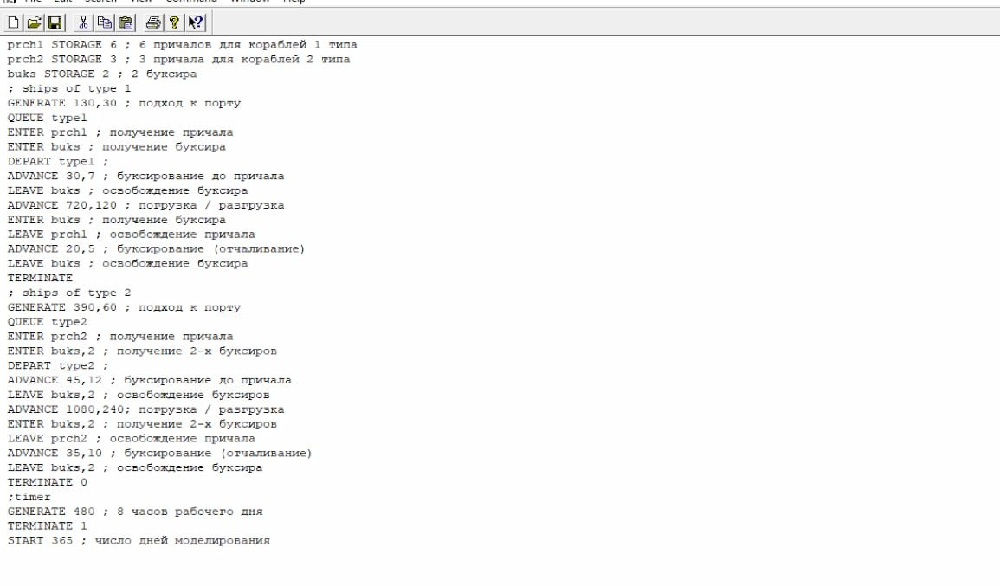
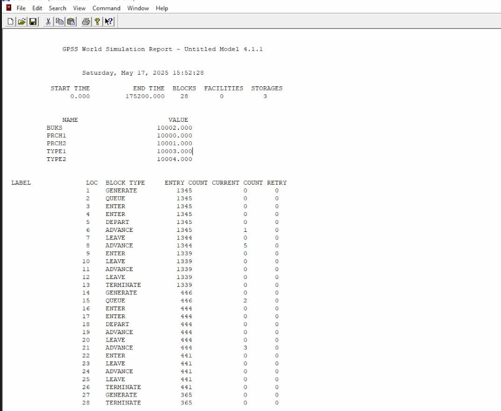
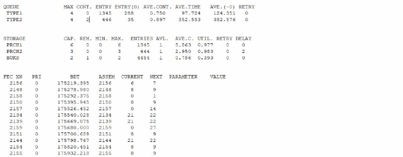

---
## Front matter
lang: ru-RU
title: Лабораторная работа №15
subtitle: Модели обслуживания с приоритетами
author:
  - Алиева Милена Арифовна
institute:
  - Российский университет дружбы народов, Москва, Россия

## i18n babel
babel-lang: russian
babel-otherlangs: english

## Formatting pdf
toc: false
toc-title: Содержание
slide_level: 2
aspectratio: 169
section-titles: true
theme: metropolis
header-includes:
 - \metroset{progressbar=frametitle,sectionpage=progressbar,numbering=fraction}
 - '\makeatletter'
 - '\beamer@ignorenonframefalse'
 - '\makeatother'
---

# Содержание 

1. Цель
2. Задания
3. Порядок выполнения 
4. Вывод

# Цель работы

Реализовать модели обслуживания с приоритетами и провести анализ результатов 

# Задание

Реализовать с помощью gpss модель обслуживания механиков на складе и модель обслуживания в порту судов двух типов

# Порядок выполнения

Задание 1: На фабрике на складе работает один кладовщик, который выдает запасные части механикам, обслуживающим станки. Время, необходимое для удовлетворения запроса, зависит от типа запасной части.Запросы бывают двух категорий. Для первой
категории интервалы времени прихода механиков $420 \pm 360$ сек., время обслуживания -- $300 \pm 90$ сек. Для второй категории интервалы времени прихода механиков $360 \pm 240$ сек., время обслуживания -- $100 \pm 30$ сек
Порядок обслуживания механиков кладовщиком такой: запросы первой категории обслуживаются только в том случае, когда в очереди нет ни одного запроса второй категории. Внутри одной категории дисциплина обслуживания -- "первым пришел -- первым обслужился". Необходимо создать модель работы кладовой, моделирование выполнять в течение восьмичасового рабочего дня.

# Порядок выполнения

Таким образом, получаем модель (рис. [-@fig:001])

{#fig:001 width=70%}

# Порядок выполнения

После запуска симуляции получаем отчёт (рис. [-@fig:002])

{#fig:002 width=70%}

# Порядок выполнения

Задание 2: Морские суда двух типов прибывают в порт, где происходит их разгрузка. В порту есть два буксира, обеспечивающих ввод и вывод кораблей из порта. К первому типу судов относятся корабли малого тоннажа, которые требуют использования одного буксира. Корабли второго типа имеют большие размеры, и для их ввода и вывода из порта требуется два буксира. Из-за различия размеров двух типов кораблей необходимы и причалы различного размера. Кроме того, корабли имеют различное время погрузки/разгрузки. 

# Порядок выполнения

Получаем модель (рис. [-@fig:003]):

{#fig:003 width=70%}

# Порядок выполнения

Получим отчет по симуляции (рис. [-@fig:004], [-@fig:005]).

{#fig:004 width=70%}

# Порядок выполнения

{#fig:005 width=70%}

# Выводы

В результате данной лабораторной работы я реализовала с помощью gpss модель обслуживания механиков на складе и модель обслуживания в порту судов двух типов

