---
## Front matter
lang: ru-RU
title: Лабораторная работа №16
subtitle: Задачи оптимизации. Модель двух стратегий обслуживания
author:
  - Алиева Милена Арифовна
institute:
  - Российский университет дружбы народов, Москва, Россия

## i18n babel
babel-lang: russian
babel-otherlangs: english

## Formatting pdf
toc: false
toc-title: Содержание
slide_level: 2
aspectratio: 169
section-titles: true
theme: metropolis
header-includes:
 - \metroset{progressbar=frametitle,sectionpage=progressbar,numbering=fraction}
 - '\makeatletter'
 - '\beamer@ignorenonframefalse'
 - '\makeatother'
---

# Содержание 

1. Цель
2. Задания
3. Порядок выполнения 
4. Вывод

# Цель работы

Реализовать с помощью gpss модель двух стратегий обслуживания и оценить оптимальные параметры

# Задание

Реализовать с помощью gpss модель с двумя очередями, модель с одной очередью и изменить модели, чтобы определить оптимальное число пропускных пунктов

# Порядок выполнения

Задание: На пограничном контрольно-пропускном пункте транспорта имеются 2 пункта
пропуска. Интервалы времени между поступлением автомобилей имеют экспоненциальное распределение со средним значением $\mu$. Время прохождения автомобилями
пограничного контроля имеет равномерное распределение на интервале $[a, b]$.
Предлагается две стратегии обслуживания прибывающих автомобилей:
- автомобили образуют две очереди и обслуживаются соответствующими пунктами
пропуска;
- автомобили образуют одну общую очередь и обслуживаются освободившимся
пунктом пропуска.
Исходные данные: $\mu$ = 1, 75 мин, $a$ = 1 мин, $b$ = 7 мин.

# Порядок выполнения

Для первой стратегии обслуживания, когда прибывающие автомобили образуют
две очереди и обслуживаются соответствующими пропускными пунктами, имеем
следующую модель (рис. [-@fig:001]).

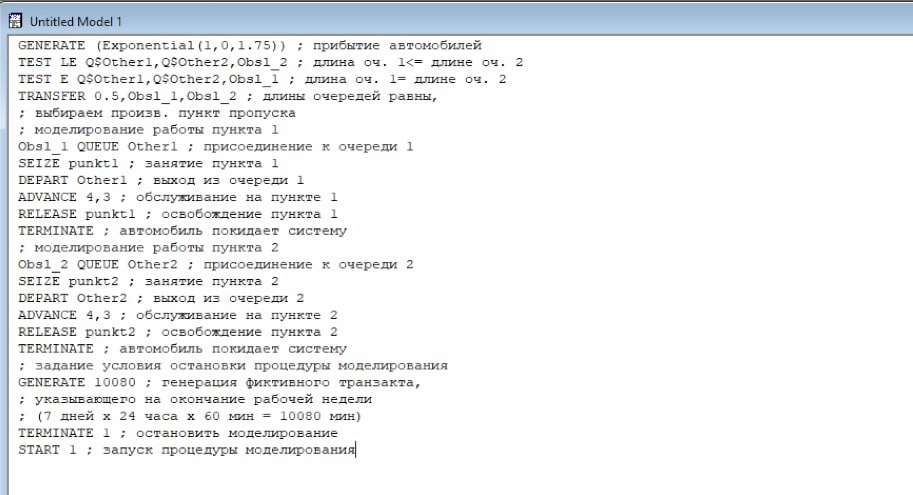{#fig:001 width=70%}

# Порядок выполнения

После запуска симуляции получим отчёт (рис. [-@fig:002]).

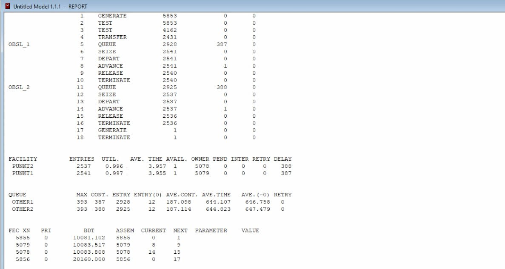{#fig:002 width=70%}

# Порядок выполнения

Составим модель для второй стратегии обслуживания, когда прибывающие автомобили образуют одну очередь и обслуживаются освободившимся пропускным пунктом (рис. [-@fig:003], [-@fig:004]).

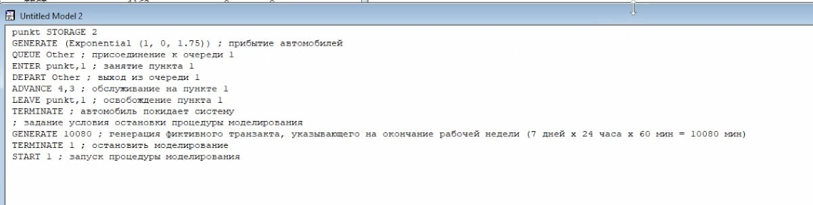{#fig:003 width=70%}

# Порядок выполнения

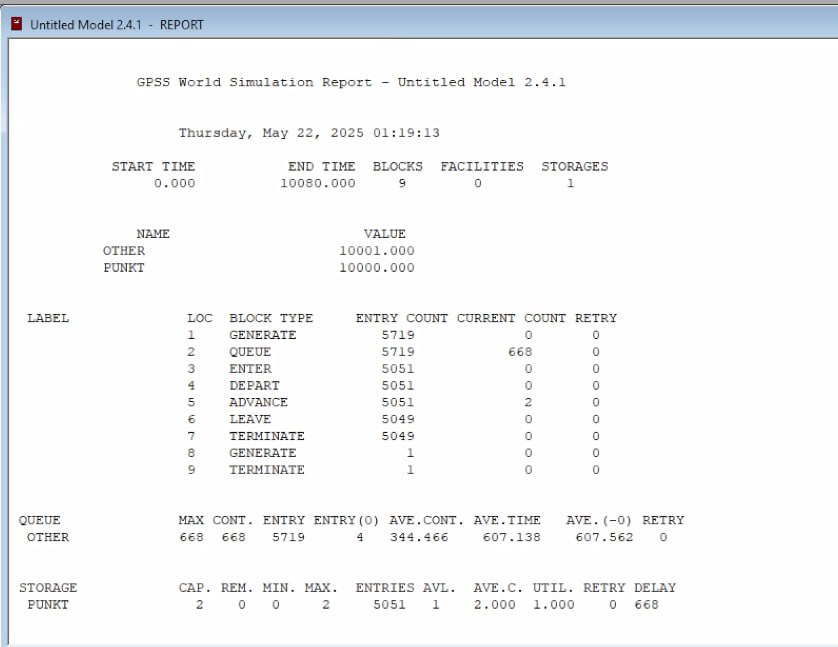{#fig:004 width=70%}

# Порядок выполнения

| Показатель                 | стратегия 1 |         |          |  стратегия 2 |
|----------------------------|-------------|---------|----------|--------------|
|                            | пункт 1     | пункт 2 | в целом  |              |
| Поступило автомобилей      | 2928        | 2925    | 5853     | 5719         |
| Обслужено автомобилей      | 2540        | 2536    | 5076     | 5049         |
| Коэффициент загрузки       | 0,997       | 0,996   | 0,9965   | 1            |
| Максимальная длина очереди | 393         | 393     | 786      | 668          |
| Средняя длина очереди      | 187,098     | 187,114 | 374,212  | 344,466      |
| Среднее время ожидания     | 644,107     | 644,823 | 644,465  | 607,138      |

# Порядок выполнения

Попробуем оптимизировать две стратегии - изменим модели, чтобы определить оптимальное число пропускных пунктов (от 1 до 4). Нам нужно:
- коэффициент загрузки пропускных пунктов принадлежит интервалу [0, 5; 0, 95];
- среднее число автомобилей, одновременно находящихся на контрольно пропускном пункте, не должно превышать 3;
- среднее время ожидания обслуживания не должно превышать 4 мин.
Для обеих стратегий модель с одним пунктом выглядит одинаково (рис. [-@fig:005]).

# Порядок выполнения

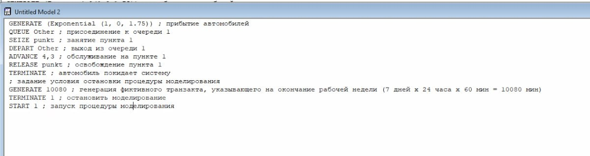{#fig:005 width=70%}

# Порядок выполнения

После симуляции получим следующий отчет (рис. [-@fig:005]).

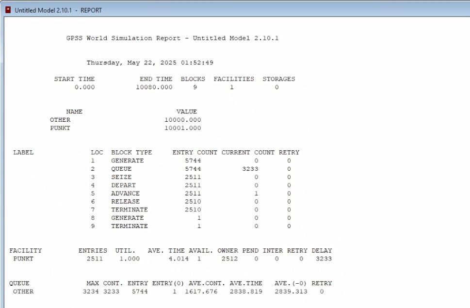{#fig:006 width=70%}

# Порядок выполнения

Построим модель для первой стратегии с 3 пропускными пунктами и получим отчет (рис. [-@fig:007], [-@fig:008]).

# Порядок выполнения

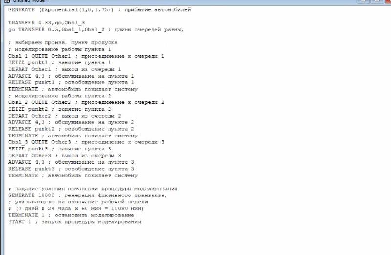{#fig:007 width=70%}

# Порядок выполнения

В этом случае среднее количество автомобилей в очереди меньше 3 и коэффициент загрузки в нужном диапазоне, но среднее время ожидания больше 4.

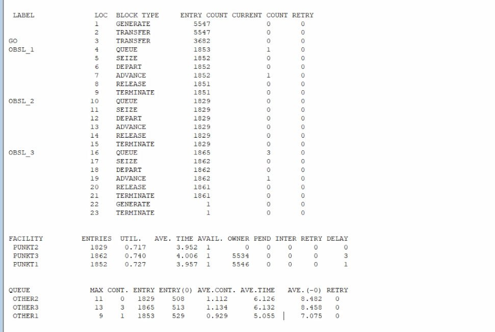{#fig:008 width=70%}

# Порядок выполнения

Построим модель для первой стратегии с 4 пропускными пунктами (рис. [-@fig:009], [-@fig:010]).

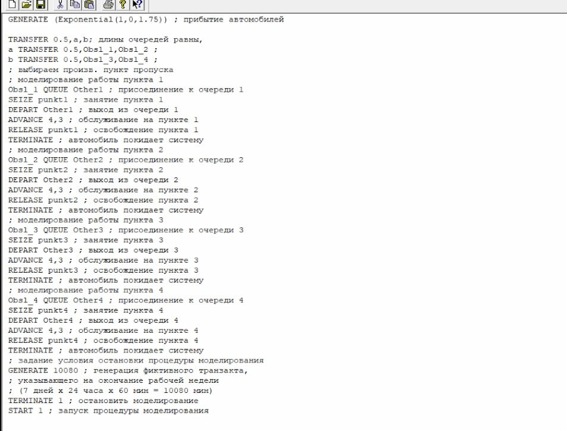{#fig:009 width=70%}

# Порядок выполнения

В этом случае все критерии выполнены, поэтому 4 пункта являются оптимальным количеством для первой стратегии.

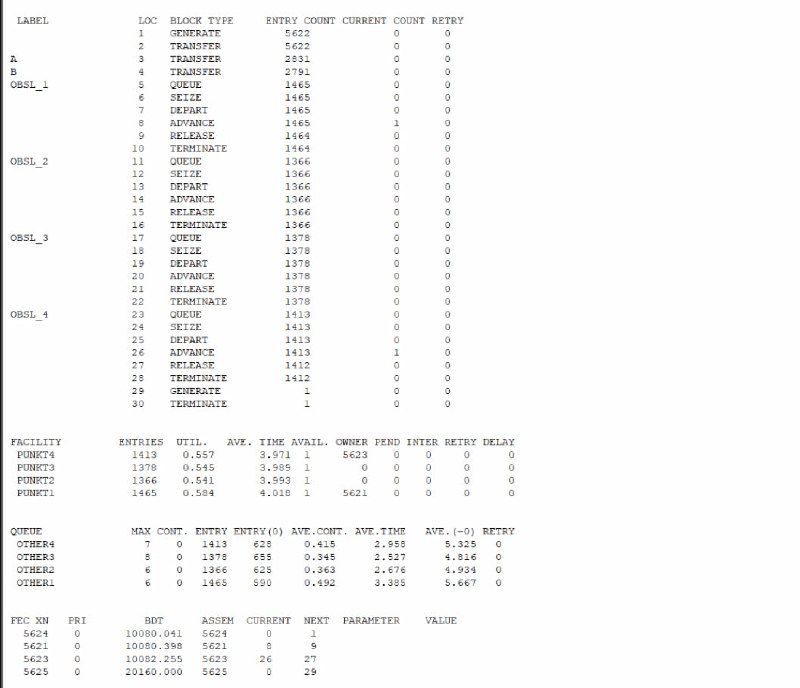{#fig:010 width=70%}

# Порядок выполнения

Построим модель для второй стратегии с 3 пропускными пунктами и получим отчет (рис. [-@fig:011], [-@fig:012]).

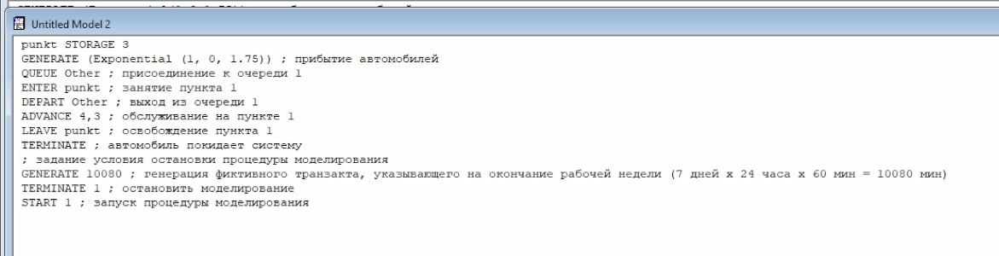{#fig:011 width=70%}

# Порядок выполнения

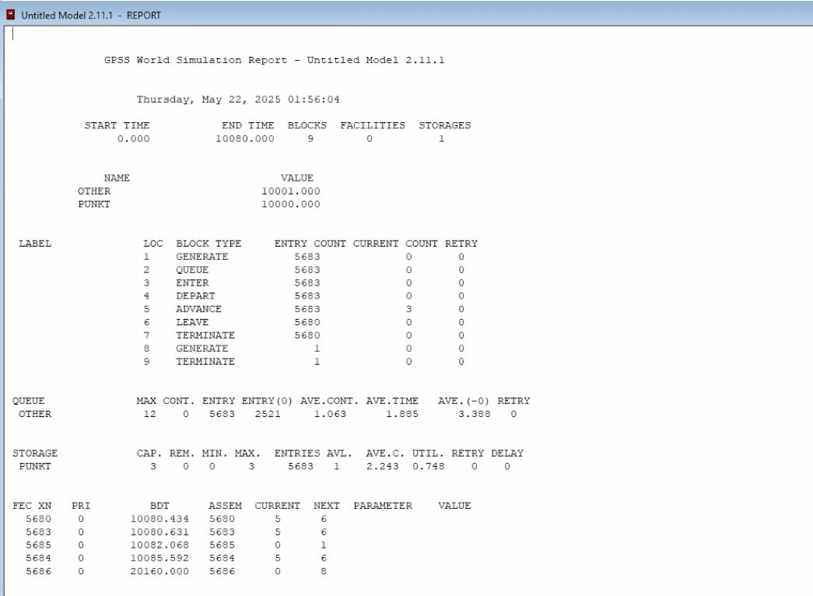{#fig:012 width=70%}

В этом случае все критерии выполняются, поэтому модель оптимальна.

# Порядок выполнения

Построим модель для второй стратегии с 4 пропускными пунктами и получим отчет (рис. [-@fig:011], [-@fig:012]).

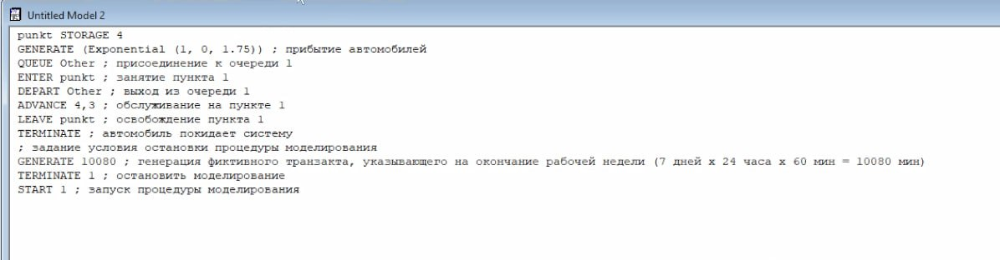{#fig:013 width=70%}

# Порядок выполнения

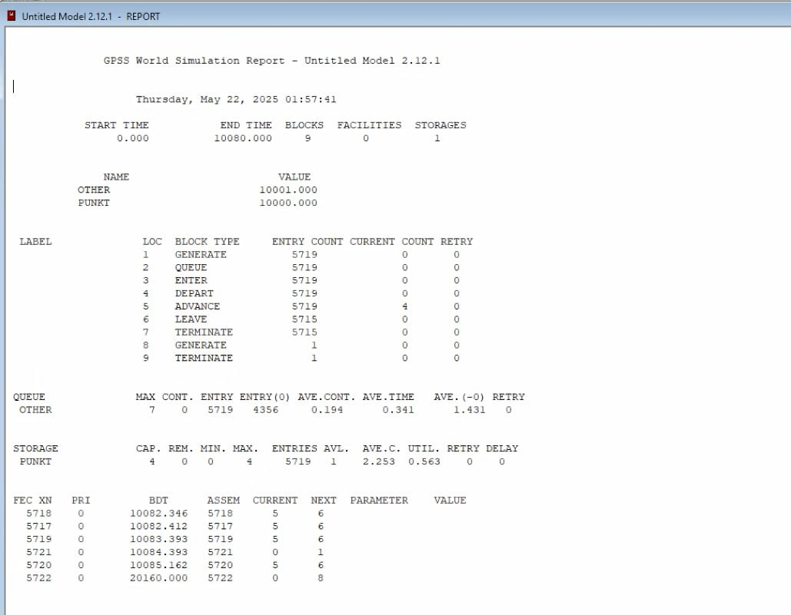{#fig:014 width=70%}

# Порядок выполнения

Здесь все критерии выполнены при этом время ожидания и среднее число автомобилей меньше, чем в случае второй стратегии с 3 пунктами, однако и загрузка меньше. Можно сделать вывод, что 4 пропускной пункт излишне разгружает систему.
В результате анализа наилучшим количеством пропускных пунктов будет 3 для второго типа обслуживания и 4 для первого.

# Выводы

Реализовать с помощью gpss модель двух стратегий обслуживания и оценить оптимальные параметры

