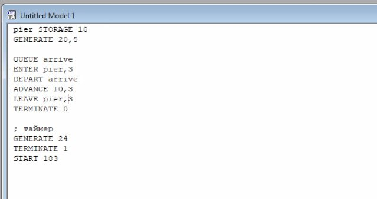

---
## Front matter
lang: ru-RU
title: Лабораторная работа №17
subtitle: Задания для самостоятельной работы
author:
  - Алиева Милена Арифовна
institute:
  - Российский университет дружбы народов, Москва, Россия

## i18n babel
babel-lang: russian
babel-otherlangs: english

## Formatting pdf
toc: false
toc-title: Содержание
slide_level: 2
aspectratio: 169
section-titles: true
theme: metropolis
header-includes:
 - \metroset{progressbar=frametitle,sectionpage=progressbar,numbering=fraction}
 - '\makeatletter'
 - '\beamer@ignorenonframefalse'
 - '\makeatother'
---

# Содержание 

1. Цель
2. Задания
3. Порядок выполнения 
4. Вывод

# Цель работы

Реализовать с помощью gpss модели работы вычислительного центра, аэропорта и морского порта.

# Задание

Реализовать с помощью gpss:

- модель работы вычислительного центра
- модель работы аэропорта
- модель работы морского порта

# Порядок выполнения

1) На вычислительном центре в обработку принимаются три класса заданий А, В и С. Исходя из наличия оперативной памяти ЭВМ задания классов А и В могут решаться одновременно, а задания класса С монополизируют ЭВМ. Задачи класса С загружаются в ЭВМ, если она полностью свободна. Задачи классов А и В могут дозагружаться к решающей задаче. Задается хранилище ram на две заявки. Затем записаны три блока: первые два обрабатывают задания класса A и B, используя один элемент ram, а третий обрабатывает задания класса C, используя два элемента ram. 

# Порядок выполнения

{#fig:001 width=70%}

# Порядок выполнения

Смоделируем работу ЭВМ за 80 ч. и определим её загрузку. После запуска симуляции получаем отчёт 

{#fig:002 width=70%}

# Порядок выполнения

{#fig:003 width=70%}

# Порядок выполнения

Самолёты прибывают для посадки в район аэропорта каждые $10 \pm 5$ мин. Если взлетно-посадочная полоса свободна, прибывший самолёт получает разрешение на посадку. Если полоса занята, самолет выполняет полет по кругу и возвращается в аэропорт каждые 5 мин. Если после пятого круга самолет не получает разрешения на посадку, он отправляется на запасной аэродром. В аэропорту через каждые $10 \pm 2$ мин к взлетно -посадочной полосе выруливают готовые к взлёту самолёты и получают разрешение на взлёт, если полоса свободна. Для взлета и посадки самолёты занимают полосу ровно на 2 мин. Если при свободной полосе одновременно один самолёт прибывает для посадки, а другой - для взлёта, то полоса предоставляется взлетающей машине.

Требуется:
- выполнить моделирование работы аэропорта в течение суток;
- подсчитать количество самолётов, которые взлетели, сели и были направлены на запасной аэродром;
- определить коэффициент загрузки взлетно-посадочной полосы.

# Порядок выполнения

Блок для влетающих самолетов имеет приоритет 2, для прилетающий приоритет 1, далее происходит проверка: если полоса пустая, то заявка просто отрабатывается, если нет, то происходит переход в блок ожидания. При ожидании заявка проходит в цикле 5 раз, каждый раз проверяется не освободилась ли полоса, если освободилась - переход в блок обработки, если нет - самолет обрабатывается дополнительным обработчиком отправления в запасной аэродром.

# Порядок выполнения

{#fig:004 width=70%}

# Порядок выполнения

Время моделирования задаем в минутах - 1440. После запуска симуляции получаем отчёт 

{#fig:005 width=90%}

# Порядок выполнения

{#fig:006 width=90%}

# Порядок выполнения

Морские суда прибывают в порт каждые $[\alpha \pm \delta]$ часов. В порту имеется N причалов. Каждый корабль по длине занимает M причалов и находится в порту $[b \pm \varepsilon]$ часов.
Требуется построить GPSS-модель для анализа работы морского порта в течение полугода, определить оптимальное количество причалов для эффективной работы порта.

Рассмотрим два варианта исходных данных:
1) $a = 20$ ч, $\delta = 5$ ч, $b = 10$ ч, $\varepsilon = 3$ ч, $N = 10$, $M = 3$;
2) $a = 30$ ч, $\delta = 10$ ч, $b = 8$ ч, $\varepsilon = 4$ ч, $N = 6$, $M = 2$.

# Порядок выполнения

**Первый вариант модели**

{#fig:007 width=70%}

# Порядок выполнения

После запуска симуляции получаем отчёт (рис. [-@fig:008]).

{#fig:008 width=90%}

# Порядок выполнения

При запуске с 10 причалами видно, что судна обрабатываются быстрее, чем успевают приходить новые, так как очередь не набирается. Соответственно попробуем уменьшить число причалов. Постепенно понижая, видим, что полезность возрастает. Тогда установим наименьшее возможное число причалов - 3, получаем оптимальный результат, что видно на отчете

# Порядок выполнения

{#fig:009 width=90%}

# Порядок выполнения

{#fig:010 width=90%}

# Порядок выполнения

**Второй вариант модели**

{#fig:011 width=70%}

# Порядок выполнения

После запуска симуляции получаем отчёт 

{#fig:012 width=90%}

# Порядок выполнения

При запуске с 6 причалами видно, что судна обрабатываются быстрее, чем успевают приходить новые, так как очередь не набирается. Соответственно попробуем уменьшить число причалов. Постепенно понижая, видим, что полезность возрастает. Тогда установим наименьшее возможное число причалов - 2, получаем оптимальный результат, что видно из отчета 

# Порядок выполнения

{#fig:013 width=90%}

# Порядок выполнения

{#fig:014 width=90%}

# Выводы

В результате выполнения данной лабораторной работы я реализовала с помощью gpss модель работы вычислительного центра, модель работы аэропорта, модель работы морского порта.

